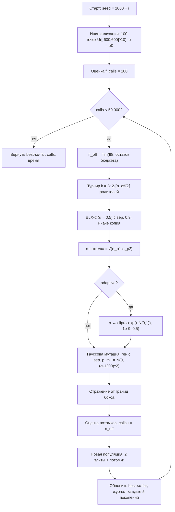
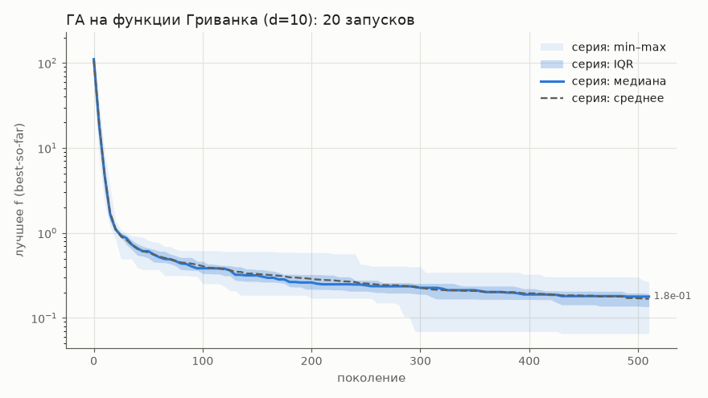
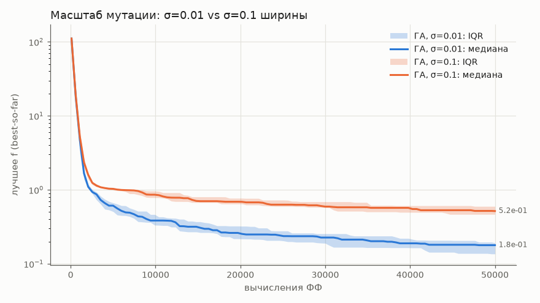
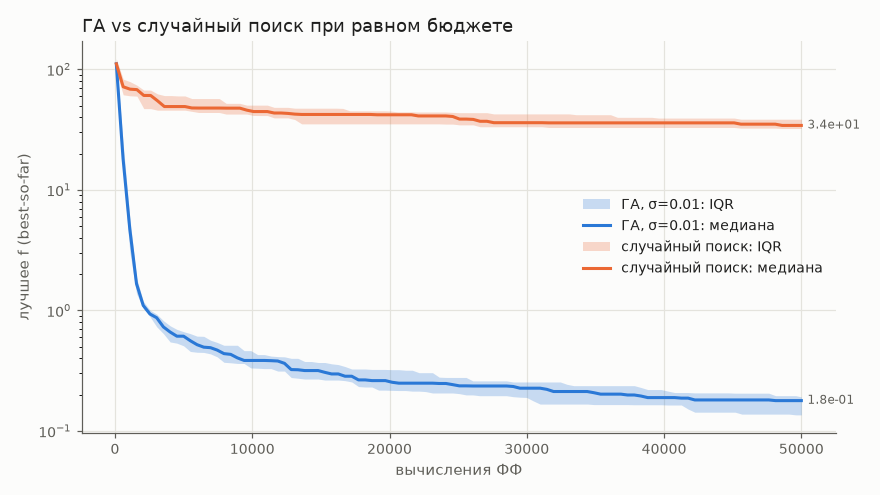
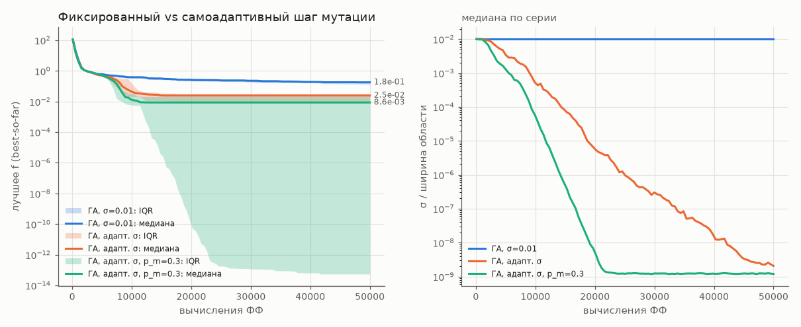
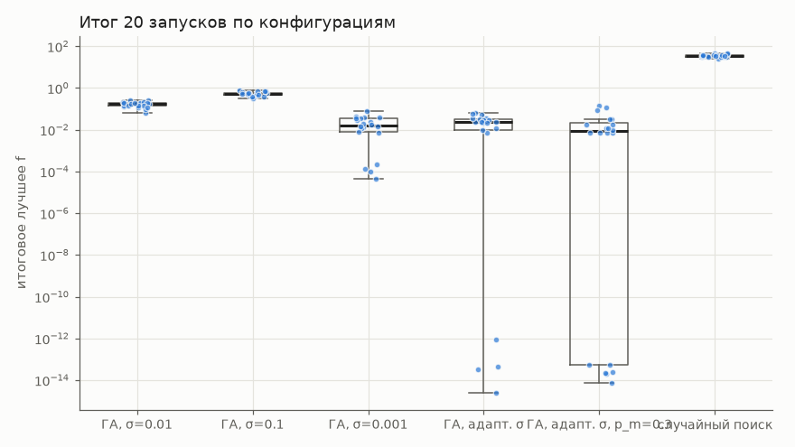

# Отчёт по лабораторной работе № 1

**Курс:** «Эволюционное программирование и генетические алгоритмы», НИЯУ МИФИ
**Тема:** многомерная оптимизация функции Гриванка вещественным генетическим алгоритмом
**Вариант:** 5 (группа 517, номер в группе $N = 3$)

---

## 1. Постановка задачи и индивидуальный вариант

Параметры индивидуализации: группа 517 $\Rightarrow Q = 1$, $N = 3$, $Y = 26$.

$$V = 1 + \big((17N + 7Q + Y) \bmod 20\big) = 1 + \big((51 + 7 + 26) \bmod 20\big) = 1 + (84 \bmod 20) = 5,$$
$$d = 5 + (V \bmod 6) = 5 + 5 = 10.$$

Варианту $V = 5$ соответствует **функция Гриванка** в размерности $d = 10$ на боксе $[-600, 600]^{10}$.
Требуется реализовать вещественный ГА (все операторы собственные), провести серии из ≥ 20 независимых запусков при фиксированном бюджете вычислений ФФ, сравнить конфигурации по одному фактору, сравнить ГА со случайным поиском и объяснить сложность функции. Дополнительное задание — **адаптивный масштаб гауссовской мутации** (самоадаптация σ).

## 2. Формальная модель

- **Пространство решений:** $D = [-600, 600]^{10} \subset \mathbb{R}^{10}$, $x = (x_1, \dots, x_{10})$.
- **Целевая функция (минимизация):**
$$f(x) = 1 + \frac{1}{4000}\sum_{i=1}^{10} x_i^2 - \prod_{i=1}^{10}\cos\!\left(\frac{x_i}{\sqrt{i}}\right).$$
- **Ограничения:** только интервальные (box), $-600 \le x_i \le 600$, $i = 1,\dots,10$; функциональных ограничений нет.
- **Теоретический минимум:** $f^* = f(0) = 0$. Так как $\frac{1}{4000}\sum x_i^2 \ge 0$ и $\prod\cos(\cdot) \le 1$, то $f(x) \ge 0$, а равенство достигается только при $x = 0$.
- **Фитнес-функция** совпадает с $f$, без штрафов и масштабирования. Селекция и элитизм сравнивают особи по $f$: меньше — лучше. Цель не искажается.
- **Критерий успеха** запуска: $f < 10^{-8}$.

## 3. Представление особи

- **Генотип = фенотип:** вещественный вектор $x \in \mathbb{R}^{10}$, $x_i \in [-600, 600]$. Декодирование тождественное, точность ограничена только float64.
- **При самоадаптации** генотип расширен стратегическим параметром: особь $= (x, \sigma)$, где $\sigma$ — шаг мутации в долях ширины области ($w = 1200$), общий для всех генов особи. На фенотип $\sigma$ не влияет, но наследуется и эволюционирует вместе с $x$.
- В неадаптивных конфигурациях $\sigma$ тоже хранится у особи, но одинаков у всех и не меняется: среднее геометрическое равных величин равно им самим.

## 4. Алгоритм, операторы и параметры

Поколенческий ГА с элитизмом (`lab1/ga.py`, общее ядро `evo_core/`):

1. **Инициализация:** $n = 100$ точек, равномерно распределённых в боксе (`init_uniform`).
2. **Селекция родителей:** турнир размера $k = 3$ с возвращением.
3. **Кроссовер BLX-α** ($\alpha = 0.5$) с вероятностью $p_c = 0.9$ на пару. Ген потомка $\sim U[\min - \alpha I,\ \max + \alpha I]$, где $I = |p_{1i} - p_{2i}|$. Каждая пара даёт двух независимых потомков; пары без кроссовера копируют родителей.
4. **Наследование шага:** $\sigma_{\text{child}} = \sqrt{\sigma_{p_1}\sigma_{p_2}}$.
5. **Самоадаптация (доп. задание):** $\sigma' = \mathrm{clip}\big(\sigma\cdot e^{\tau N(0,1)},\ 10^{-9},\ 0.5\big)$, $\tau = 1/\sqrt{d} \approx 0.316$ (логнормальное правило Швефеля). Новый шаг сразу используется в мутации.
6. **Гауссова мутация:** каждый ген с вероятностью $p_m$ получает сдвиг $N(0, (\sigma w)^2)$.
7. **Границы:** зеркальное отражение (`reflect`), корректное и при выходе дальше ширины области: $y = (x - l) \bmod 2w$; при $y > w$ полагаем $y \leftarrow 2w - y$.
8. **Замещение:** 2 лучшие особи (элита) + 98 потомков.
9. **Остановка:** исчерпание бюджета в 50 000 вызовов ФФ. Счётчик `Evaluator` не допускает превышения. Последнее поколение усечено: $100 + 509\cdot 98 = 49\,982$, в 510-м поколении оценивается 18 потомков, итого ровно 50 000 вызовов.

### Таблица параметров (из `lab1/configs/*.toml`)

| параметр | `ga_base` | `ga_sigma_large` | `ga_adaptive` | `ga_adaptive_pm03` | `random_search` |
|---|---|---|---|---|---|
| алгоритм | ГА | ГА | ГА | ГА | равномерная выборка |
| $d$, область | 10, $[-600,600]$ | = | = | = | = |
| размер популяции | 100 | 100 | 100 | 100 | порции по 100 |
| бюджет ФФ (остановка) | 50 000 | 50 000 | 50 000 | 50 000 | 50 000 |
| элитизм | 2 | 2 | 2 | 2 | — |
| селекция | турнир, $k=3$ | = | = | = | — |
| кроссовер, $\alpha$, $p_c$ | BLX, 0.5, 0.9 | = | = | = | — |
| $p_m$ (на ген) | 0.1 $(=1/d)$ | 0.1 | 0.1 | **0.3** | — |
| начальный σ (доля ширины) | 0.01 (=12) | **0.1 (=120)** | 0.01 | 0.01 | — |
| самоадаптация σ | нет | нет | **да** | **да** | — |
| $\tau$ | — | — | 0.316 | 0.316 | — |
| границы σ | — | — | $[10^{-9}, 0.5]$ | $[10^{-9}, 0.5]$ | — |
| выход за границы | отражение | = | = | = | не возникает |
| инициализация | равномерная | = | = | = | равномерная |
| запуски / seed | 20 / 1000…1019 | = | = | = | = |

Ранговая селекция (`rank_s`) и равномерный кроссовер реализованы в ядре, но в этих конфигурациях не используются. Контрольная конфигурация `ga_sigma_small` отличается от `ga_base` только шагом σ = 0.001 (лучшее значение предварительной развёртки).

**Seed:** запуск $i$ использует $1000 + i$, $i = 0,\dots,19$; у каждого запуска свой `numpy.random.default_rng(seed)`.

**Методика настройки.** Параметры подбирались на seed 0–9, итоговые серии идут на seed 1000–1019, так что настройка отделена от проверки. Развёртка воспроизводится командой `python -m lab1.sweep` и пишет результат в `results/sweep_sigma.csv`. При фиксированном $\sigma \in \{0.1, 0.03, 0.01, 0.003, 0.001\}$ медиана монотонно улучшалась с уменьшением σ (0.44 → 0.013), но ни один запуск не достиг $f < 10^{-8}$. При самоадаптации медиана слабо зависит от начального σ (0.028–0.042), и успехи были при трёх значениях σ из пяти. База $\sigma = 0.01$ выбрана как «1 % ширины», **а не как лучшая по развёртке**.

## 5. Блок-схема



## 6. Обоснование операторов относительно структуры задачи

- **Вещественное кодирование.** Область огромна ($1200^{10}$), а глобальный бассейн узок: бинарная сетка разумной длины не даёт точности $10^{-8}$. Вещественный вектор даёт точность float64 и позволяет использовать непрерывные операторы.
- **BLX-α, $\alpha = 0.5$.** У функции глобальная квадратичная «чаша» с минимумом в 0. BLX порождает потомков в окрестности отрезка между родителями. При $\alpha = 0.5$ дисперсия гена примерно сохраняется, поэтому кроссовер сам по себе не схлопывает популяцию, а шаг пропорционален её разбросу: сначала крупные шаги по чаше, затем уточнение. Для несепарабельной функции покомпонентный BLX лучше равномерного обмена генами, который лишь переставляет уже имеющиеся координаты.
- **Гауссова мутация, $p_m = 1/d$.** В среднем меняется одна координата. Это сдвиг вдоль оси, то есть переход между соседними узлами решётки косинусов (период по оси $i$ равен $2\pi\sqrt i \approx 6.3\dots19.9$). Шаг $\sigma = 0.01\cdot1200 = 12$ сопоставим с периодом.
- **Самоадаптация σ.** Фиксированный шаг не может одновременно перепрыгивать бассейны ($\sim 10$) и доводить решение до $10^{-8}$ (нужно $\lesssim 10^{-4}$). Логнормальное правило позволяет σ уменьшаться на порядки; $\tau = 1/\sqrt d$ — классическая рекомендация.
- **Турнир с $k = 3$:** умеренное давление, инвариантное к монотонным преобразованиям $f$. Рулетке на $f \in [0, 900]$ потребовалось бы масштабирование.
- **Элитизм 2:** best-so-far не ухудшается, найденный бассейн сохраняется, а доля элиты мала (2 %).
- **Отражение** не создаёт «налипания» на грань, в отличие от `clip`. Минимум находится в центре, так что граница никакой ценности не несёт.

## 7. Результаты

Во всех сериях 20 запусков по 50 000 вызовов ФФ (`evals = 50000` в каждой строке `*_summary.csv`). ГА делает 510 поколений, случайный поиск — 500 порций по 100 точек.

### 7.1. Сводная таблица (`results/summary.md`)

| конфигурация | best | mean | median | std | worst | f<1e-8 | допустимо | время/запуск, с | вызовов ФФ |
|---|---|---|---|---|---|---|---|---|---|
| ГА, σ=0.01 | 6.564e-02 | 1.682e-01 | 1.785e-01 | 5.110e-02 | 2.680e-01 | 0/20 | 100% | 0.043 | 50000 |
| ГА, σ=0.1 | 3.236e-01 | 5.340e-01 | 5.163e-01 | 1.217e-01 | 7.844e-01 | 0/20 | 100% | 0.042 | 50000 |
| ГА, σ=0.001 (контроль) | 4.525e-05 | 2.154e-02 | 1.612e-02 | 1.928e-02 | 7.644e-02 | 0/20 | 100% | 0.045 | 50000 |
| ГА, адапт. σ | 2.554e-15 | 2.424e-02 | 2.458e-02 | 1.920e-02 | 6.404e-02 | 4/20 | 100% | 0.042 | 50000 |
| ГА, адапт. σ, p_m=0.3 | 7.438e-15 | 2.534e-02 | 8.627e-03 | 4.103e-02 | 1.475e-01 | 6/20 | 100% | 0.042 | 50000 |
| случайный поиск | 2.518e+01 | 3.550e+01 | 3.422e+01 | 5.353e+00 | 4.728e+01 | 0/20 | 100% | 0.011 | 50000 |

Допустимых решений 100 %: отражение переводит любую точку внутрь бокса. Это проверено юнит-тестом `test_ga_respects_bounds_budget_and_is_reproducible` (границы, точный бюджет, воспроизводимость).

### 7.2. U-тест Манна—Уитни

Тест двусторонний, нормальная аппроксимация с поправкой на связки; $z < 0$ означает, что A лучше.

| A vs B | медиана A | медиана B | U | z | p |
|---|---|---|---|---|---|
| ГА, σ=0.01 vs случайный поиск | 1.785e-01 | 3.422e+01 | 0 | -5.41 | 6.30e-08 |
| ГА, σ=0.01 vs ГА, σ=0.1 | 1.785e-01 | 5.163e-01 | 0 | -5.41 | 6.30e-08 |
| ГА, адапт. σ vs ГА, σ=0.01 | 2.458e-02 | 1.785e-01 | 0 | -5.41 | 6.30e-08 |
| ГА, адапт. σ vs ГА, σ=0.001 | 2.458e-02 | 1.612e-02 | 201 | 0.03 | 9.78e-01 |
| ГА, адапт. σ, p_m=0.3 vs ГА, адапт. σ | 8.627e-03 | 2.458e-02 | 150 | -1.34 | 1.80e-01 |

$U = 0$ означает полное разделение: каждый запуск A лучше каждого запуска B. Все пары однофакторные: `ga_adaptive_pm03` сравнивается с `ga_adaptive`, а не с базой. Различие медиан 0.025 и 0.0086 статистически не подтверждено ($p = 0.18$).

**Контроль `ga_sigma_small`.** Это лучший фиксированный шаг из предварительной развёртки (σ = 0.001), проверенный на итоговых seed. По медиане он не отличается от самоадаптации ($p = 0.98$). Разница в точности: самоадаптация находит глобальный минимум с точностью $10^{-15}$ в 4 запусках из 20, а σ = 0.001 — ни разу; его лучший результат $4.5\cdot10^{-5}$.

### 7.3. Графики



*Рис. 1. Эксперимент 2: best-so-far базового ГА по поколениям, 20 запусков; медиана, IQR, диапазон min–max и среднее (пунктир), логарифмическая шкала. За ~20 поколений $f$ падает со $\sim10^2$ до $\sim1$, затем медленно снижается до медианы 0.18. Разброс узкий: 0.07–0.27.*



*Рис. 2. Эксперимент 3: σ = 0.01 против σ = 0.1 ширины, это единственный изменённый фактор. Первые ~2 000 вызовов кривые совпадают (работает BLX), затем крупный шаг проигрывает: 0.52 против 0.18, межквартильные диапазоны не пересекаются.*



*Рис. 3. Эксперимент 4: ГА против равномерной выборки при тех же 50 000 вызовах и seed. Случайный поиск доходит лишь до медианы 34, а ГА проходит этот уровень примерно за 500 вызовов.*



*Рис. 4. Доп. задание. Слева — best-so-far при фиксированном и самоадаптивном σ ($p_m = 0.1$ и $0.3$). Справа — медиана σ по серии в долях ширины области. При $p_m = 0.3$ нижний квартиль доходит до $\sim10^{-13}$, а медиана останавливается на $8.6\cdot10^{-3}$. σ падает монотонно и к ~22 000 вызовов упирается в нижнюю границу $10^{-9}$.*



*Рис. 5. Итоговое лучшее $f$ всех 100 запусков, логарифмическая шкала. У адаптивных конфигураций распределение бимодально: кластер $10^{-15}\dots10^{-12}$ (глобальный минимум) и кластер $\sim10^{-2}$ (локальные минимумы вблизи нуля).*

### 7.4. Эксперимент 5: почему функция Гриванка сложна

**Рельеф.** $f$ — это сумма квадратичной чаши $\|x\|^2/4000$ (до $\approx 900$ на краях) и осциллирующего члена $-\prod\cos(x_i/\sqrt i)$ с амплитудой 1 и периодом $2\pi\sqrt i$ по $i$-й оси. Локальные минимумы лежат около узлов $x_i \approx \pi k_i\sqrt i$ с чётным числом нечётных $k_i$. Число узлов на $[-600,600]^{10}$:
$$\prod_{i=1}^{10}\frac{1200}{2\pi\sqrt i} = \frac{191^{10}}{\sqrt{10!}} \approx \frac{6.5\cdot10^{22}}{1.9\cdot10^{3}} \sim 10^{19}.$$
Из-за произведения функция несепарабельна.

**Локальный поиск: ловушки у нуля.** Значение в локальном минимуме примерно равно штрафу чаши:
$$f \approx \frac{\pi^2}{4000}\sum_i i\,k_i^2 .$$
Ближайшие ловушки: $3\pi^2/4000 \approx 0.0074$ ($x_1 \approx \pm\pi$, $x_2 \approx \pm\pi\sqrt2$), $4\pi^2/4000 \approx 0.0099$, $5\pi^2/4000 \approx 0.0123$, $7\pi^2/4000 \approx 0.0173$, $8\pi^2/4000 \approx 0.0197$. Эти значения буквально встречаются в данных: 0.00739604 (5 из 40 адаптивных запусков), 0.00985728, 0.0123161, 0.0172263, а также 0.0221, 0.0246, 0.0296, 0.0320. Чтобы выйти из ловушки, нужно сдвинуть 1–2 координаты на $\sim\pi\sqrt i$ через барьер высотой $\sim1$, а мелкие шаги на это не способны. С ростом $d$ рельеф относительно сглаживается и чаша начинает доминировать (Locatelli, 2003), но узкий глобальный бассейн у нуля по-прежнему окружён ловушками уровня $10^{-2}$.

**Случайный поиск: объём.** Объём бассейна глобального минимума ($|x_i| < \pi\sqrt i$) равен $(2\pi)^{10}\sqrt{10!} \approx 1.9\cdot10^{11}$, а объём области — $1200^{10} \approx 6.2\cdot10^{30}$. Доля бассейна $\sim3\cdot10^{-20}$, для уровня $f < 10^{-8}$ — $\sim10^{-66}$. При $5\cdot10^4$ выборках вероятность попасть в бассейн $\sim10^{-15}$. Фактически случайный поиск получает лишь $f \approx 25\dots47$.

## 8. Анализ результатов

1. **ГА против случайного поиска.** Медиана 0.18 против 34, то есть в ~190 раз (≈2.3 порядка), $U = 0$. Для адаптивного ГА разница ≈3.6 порядка по медиане и ≈16 порядков по лучшему запуску. Выигрыш обеспечивает направленность поиска: селекция и BLX спускают популяцию по чаше в окрестность $\|x\| \lesssim 20$, объём которой на ~22 порядка меньше бокса.
2. **Масштаб мутации.** σ = 0.1 (шаг 120) хуже, чем σ = 0.01: 0.52 против 0.18, $U = 0$. Шаг многократно превышает период косинусов, поэтому почти каждый мутировавший потомок портится, и уточнение идёт только за счёт BLX. Это согласуется с развёрткой: медиана монотонно улучшается с уменьшением σ.
3. **Фиксированный σ не даёт доводки.** Абсолютный шаг 12 на порядки больше требуемой точности: 0 успехов из 20, лучший результат 0.066. База стабильно застревает на уровне $10^{-1}$.
4. **Самоадаптация σ.** Медиана лучше в 7 раз (0.025 против 0.18, $U = 0$). Глобальный минимум найден с машинной точностью: в 4 запусках из 20 при $p_m = 0.1$ и в 6 из 20 при $p_m = 0.3$. σ уменьшается на 7 порядков: алгоритм сам переходит от исследования к эксплуатации.
5. **Преждевременная сходимость.** Медиана σ монотонно падает и не растёт (рис. 4 справа). При $p_m = 0.3$ она достигает нижней границы $10^{-9}$ (абсолютный шаг $1.2\cdot10^{-6}$) к ~22 000 вызовов. После этого медиана best-so-far не меняется до конца: запуски в ловушках 0.0074, 0.0099 и т. д. стоят на месте, и ~28 000 вызовов тратятся впустую. Причина — дрейф самоадаптации. Потомки с меньшим σ реже ухудшаются, поэтому отбор поощряет уменьшение шага даже тогда, когда для выхода из бассейна нужен крупный шаг. **Самоадаптация отлично доводит решение, но убивает исследование.** При $p_m = 0.1$ σ падает медленнее (к концу ≈$2\cdot10^{-9}$), но картина та же.
6. **$p_m$ при самоадаптации.** $p_m = 0.3$ ускоряет схлопывание σ. Успехов больше (6 против 4), медиана ниже (0.0086 против 0.025), но худший запуск хуже (0.148 против 0.064), а std вдвое выше. По U-тесту различие незначимо.
7. **Время и бюджет.** Запуск ГА занимает ≈0.04 с, случайного поиска — ≈0.01 с; серия из 20 запусков — около секунды. ФФ дешёвая, поэтому ограничивающим ресурсом служит число вызовов; именно оно зафиксировано, чтобы сравнение было честным.

## 9. Выводы о влиянии параметров

- **Масштаб мутации — ключевой параметр.** При фиксированном σ шаг, нужный для перехода между бассейнами (~$2\pi\sqrt i$), несовместим с шагом, нужным для точности $10^{-8}$. Ни одно фиксированное σ из $[0.001, 0.1]$ не дало успеха.
- **Самоадаптивный σ снимает это противоречие.** Только он дал глобальный минимум (до 30 % запусков). Над базой σ = 0.01 выигрыш значим ($p < 10^{-6}$). Над лучшим фиксированным σ = 0.001 по медиане выигрыша нет ($p = 0.98$), есть только выигрыш в точности доводки (4/20 против 0/20 запусков с $f < 10^{-8}$). Значит, самоадаптация избавляет от ручного подбора σ, но саму проблему локальных ловушек не решает.
- **Цена — преждевременная сходимость.** σ схлопывается до нижней границы, ГА вырождается в локальный поиск и не покидает ловушку уровня $10^{-2}$. Это видно по медиане σ, по плато best-so-far (рис. 4) и по бимодальности итогов (рис. 5).
- **$p_m$** регулирует скорость схлопывания σ: чем больше $p_m$, тем быстрее и доводка, и «заморозка».
- **Что из этого следует:** поднять нижнюю границу σ или периодически «подогревать» σ; делать рестарты после стагнации; поддерживать разнообразие через ниши.

## 10. Оценка результата для данной задачи

Результат **приемлемый для базового ГА при 50 000 вызовах, но недостаточный для гарантированного нахождения глобального минимума.**

- *Хорошо:* ГА на порядки лучше случайного поиска — по медиане в ~200 раз для базы и в ~4000 раз для адаптивного варианта, по лучшему запуску на ~16 порядков. Все запуски приходят в окрестность нуля, к низшим уровням среди $\sim10^{19}$ локальных минимумов. Адаптивный ГА находит $f^*=0$ с точностью $10^{-14}$ в 4–6 запусках из 20.
- *Недостаточно:* база стабильно застревает на уровне $10^{-1}$ (0 успехов из 20), а адаптивный вариант в 70–80 % запусков остаётся в локальных минимумах $0.0074\dots0.15$. Для Гриванка $f \approx 10^{-2}$ означает «не тот бассейн»: 1–2 координаты сдвинуты на полпериода. Это качественно неверный ответ.
- *Почему:* трудно не прийти к нулю — чаша приводит туда любой разумный метод, — а выбрать правильный бассейн среди ловушек, которые отличаются на $\sim10^{-2}$ при барьерах $\sim1$. Для этого нужна способность исследовать и после сходимости, а именно её самоадаптация теряет.

## 11. Ограничения и что улучшить

- **Рестарты после стагнации.** σ схлопывается за ~20 000 вызовов, поэтому бюджет можно разбить на 2–3 рестарта. При 20–30 % успеха на один рестарт доля успешных запусков вырастет примерно до половины.
- **Ниши и поддержание разнообразия** (crowding, sharing, острова): разные подпопуляции исследуют разные бассейны около нуля.
- **Механизм шага:** поднять нижнюю границу σ, использовать правило 1/5 или покоординатные σ.
- **Больший бюджет** адаптивной версии без рестартов почти не помогает: после схлопывания σ вызовы тратятся впустую. Для фиксированного σ он даёт лишь медленное улучшение.
- **Ограничения эксперимента.** 20 запусков мало, чтобы уловить тонкие различия (как в случае с $p_m$). База σ = 0.01 — не лучшее фиксированное значение. Контрольная серия σ = 0.001 на итоговых seed дала медиану 0.016, как у адаптивного варианта. Поэтому преимущество самоадаптации над *наилучшим* фиксированным σ проявляется в точности и доле успехов, а не в медиане.

## 12. Воспроизведение

Из корня репозитория (см. `lab1/README.md`):

```bash
/opt/homebrew/bin/python3.12 -m venv .venv   # любой Python >= 3.11 (нужен tomllib)
.venv/bin/pip install -r requirements.txt

# все эксперименты ЛР1 (6 серий × 20 запусков), ~6 с
.venv/bin/python -m lab1.main --config lab1/configs/*.toml
# сводная таблица, U-тесты и графики
.venv/bin/python -m lab1.analyze --plots
# предварительная развёртка σ на seed 0..9, ~2 с
.venv/bin/python -m lab1.sweep
# воспроизвести лучший запуск (f = 2.554e-15)
.venv/bin/python -m lab1.main --config lab1/configs/ga_adaptive.toml --seed 1011 --runs 1 --out lab1/results/repro
# тесты
.venv/bin/python -m pytest
```

Файлы в `results/`:
- `<tag>_summary.csv` — по строке на запуск: seed, лучшее $f$, вызовы, время, допустимость, лучший $x$;
- `<tag>_gens.csv` — агрегаты по поколениям;
- `<tag>_config.json` — фактически использованные параметры;
- `summary.md` — таблица и U-тесты;
- `sweep_sigma.csv` — развёртка σ;
- `*.png` — графики.

## 13. Ответы на вопросы к защите

1. **Пространство решений и корректность представления.** $D = [-600,600]^{10}$. Вектор из 10 чисел float64 взаимно однозначно покрывает $D$; после отражения любая особь лежит в $D$; минимум $x = 0$ представим точно.
2. **Генотип и фенотип.** Совпадают: декодирование тождественное. При самоадаптации генотип $= (x, \sigma)$, а фенотип — только $x$.
3. **Не искажает ли ФФ цель?** Нет: ФФ $= f$ без штрафов и преобразований, а турнир использует только порядок значений.
4. **Допустимость и нарушения.** Ограничения только интервальные; выход за границу исправляется отражением. Доля допустимых решений — 100 %, это проверено тестом.
5. **Почему именно эти кроссовер и мутация?** BLX-α подстраивает шаг под разброс популяции и сохраняет дисперсию. Мутация с $p_m = 1/d$ сдвигает в среднем одну координату, то есть переводит в соседний бассейн. Самоадаптация σ нужна для доводки.
6. **Может ли кроссовер дать недопустимое решение?** Да: при $\alpha = 0.5$ интервал BLX выходит за пределы родителей и может выйти за бокс. Такой ген отражается внутрь до оценки ФФ.
7. **Как задаётся селективное давление?** Размером турнира $k = 3$ (лучшая особь в среднем получает ~3 копии в пуле родителей) и элитизмом $e = 2$. В ядре есть и альтернатива — параметр $s$ ранговой селекции.
8. **Почему нельзя делать выводы по одному запуску?** Распределение итогов бимодально: один запуск адаптивного ГА даёт либо $10^{-14}$, либо $10^{-2}$, примерно в соотношении 1:3. Поэтому используются серии по 20 запусков, медианы и U-тест.
9. **Seed и воспроизводимость.** Итоговые серии идут на seed 1000…1019, настройка — на 0…9. Лучший результат $2.554\cdot10^{-15}$ получен в `ga_adaptive` при seed 1011 и воспроизводится командой из раздела 12. Идентичность результатов при одинаковом seed проверяется тестом.
10. **Бюджет и честность сравнения.** Во всех конфигурациях 50 000 вызовов через единый `Evaluator` (последнее поколение усечено ровно до 50 000), одинаковые seed и одинаковая инициализация.
11. **Преждевременная сходимость.** σ падает до $10^{-9}$ к ~22 000 вызовов, best-so-far замирает, а итоги совпадают с уровнями $\pi^2 S/4000$ (0.0074, 0.0099, …). Диагностика — журнал медианы σ (рис. 4) и распределение итогов (рис. 5).
12. **Почему не точный метод?** У функции $\sim10^{19}$ локальных минимумов и она несепарабельна: градиентные методы застревают в ближайшем минимуме, а сеточный перебор нереален. ЭА не требует градиента, но и глобальный оптимум не гарантирует.
13. **Что будет при росте размерности?** Число минимумов и объём области растут экспоненциально, поэтому случайный поиск деградирует сразу. Для ГА рельеф относительно сглаживается (Locatelli, 2003), но нужны больший бюджет и покоординатные σ.
14. **Что делать при большем бюджете?** Рестарты после стагнации, ниши, большая популяция. Простое увеличение числа поколений для адаптивной версии почти не помогает.
15. **Что экспериментально, а что гарантировано?** Гарантированы: $f^* = 0$ в точке $x = 0$, допустимость решений, точный бюджет, монотонность best-so-far и воспроизводимость по seed. Экспериментальны: качество, доли успехов и значимость различий — они верны только для этих seed и этого бюджета.
