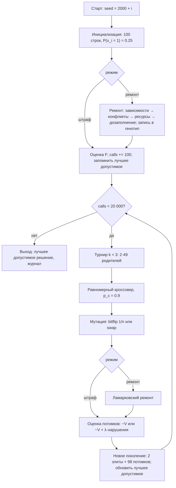
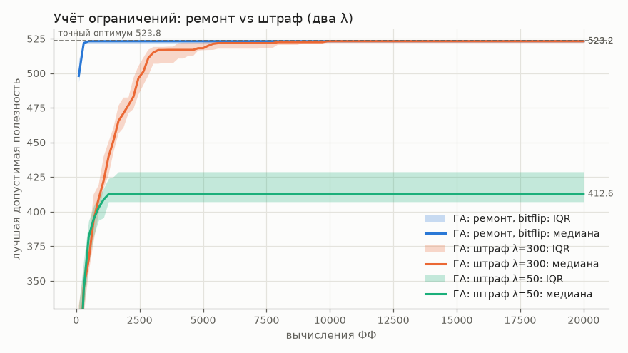
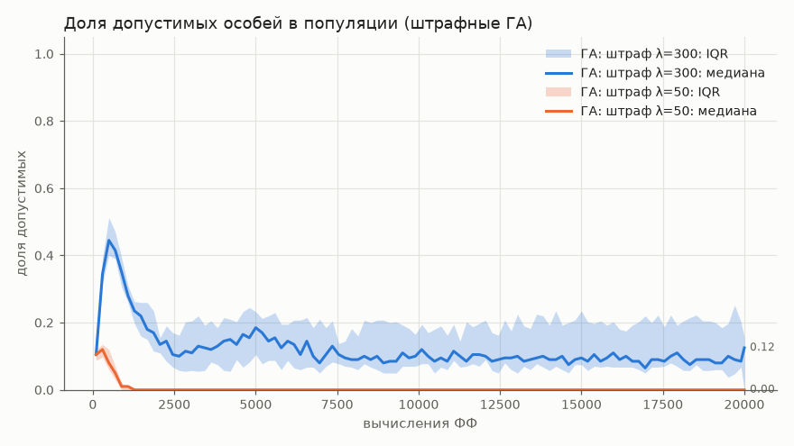
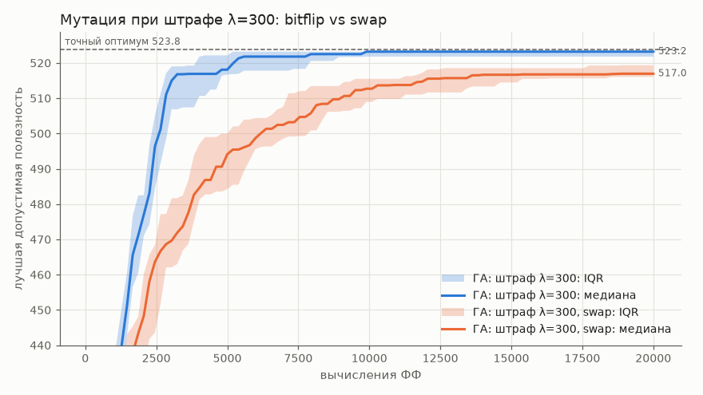
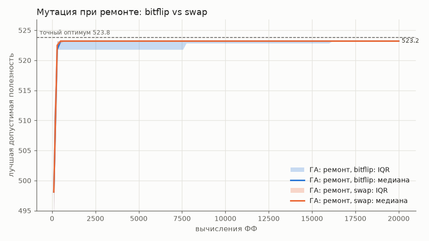
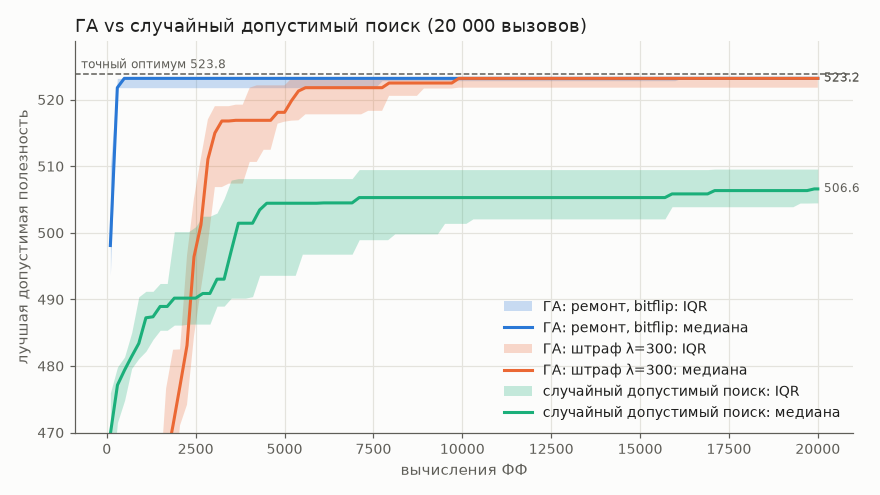
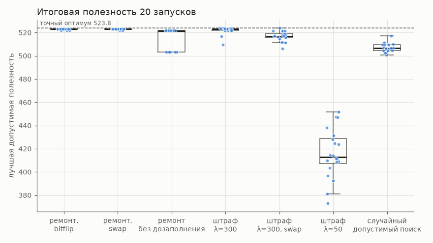

# Отчёт по лабораторной работе № 2

**Курс:** «Эволюционное программирование и генетические алгоритмы», НИЯУ МИФИ
**Тема:** генетический алгоритм для дискретной задачи с ограничениями: выбор комплекта оборудования для лаборатории
**Вариант:** 5 (группа 517, номер в группе $N = 3$)

---

## 1. Постановка задачи и индивидуальный вариант

$$V = 1 + \big((17\cdot 3 + 7\cdot 1 + 26) \bmod 20\big) = 1 + (84 \bmod 20) = 5.$$

Варианту 5 соответствует задача «**комплект оборудования для лаборатории**: бюджет, мощность, совместимость», представление «бинарная строка / множество». Из 40 приборов-кандидатов нужно выбрать набор с максимальной суммарной полезностью, который укладывается в бюджет закупки, не превышает лимит электропитания помещения и не содержит несовместимых или «неработоспособных» сочетаний приборов.

Трактовка ограничений согласована заранее:
- **мощность** — лимит электропитания помещения: суммарная потребляемая мощность выбранных приборов не больше $P$, кВт;
- **совместимость** — два вида логических ограничений: *несовместимые пары* (приборы делят единичный ресурс помещения: антивибрационное основание, линию 380 В, вентканал и т. п.) и *зависимости* «A требует B» (без B прибор A не работает).

## 2. Формальная модель

- **Пространство решений:** $X = \{0,1\}^n$, $n = 40$; $x_i = 1$ означает, что прибор $i$ закупается. Мощность пространства $2^{40} \approx 1.1\cdot 10^{12}$.
- **Целевая функция (максимизация):** $V(x) = \sum_{i=1}^{n} v_i x_i$.
- **Ограничения:**
$$\sum_i c_i x_i \le B \ \text{(бюджет)},\qquad \sum_i w_i x_i \le P \ \text{(мощность)},$$
$$x_a + x_b \le 1\ \ \forall (a,b)\in\mathcal{C}\ \text{(несовместимость)},\qquad x_a \le x_b\ \ \forall (a \to b)\in\mathcal{R}\ \text{(зависимость)}.$$
- $|\mathcal{C}| = 12$, $|\mathcal{R}| = 8$; $B = 16\,984$ тыс. ₽, $P = 14.64$ кВт.

Формально это **двумерный (многомерный) рюкзак с конфликтным графом и отношениями предшествования**. Уже одномерный рюкзак NP-труден, а конфликтный граф добавляет в задачу подзадачу о независимом множестве. Все ограничения линейны по $x$, поэтому модель является задачей ЦЛП с 22 ограничениями.

**Эталон качества.** Точный оптимум получен собственным методом ветвей и границ (`exact.py`):
- ветвление идёт по убыванию удельной полезности;
- граница — минимум двух дробных релаксаций Данцига (по бюджету и по мощности) на свободных приборах, совместимых с уже выбранными;
- стартовый рекорд даёт жадная эвристика.

Результат: $V^* = 523.8$, 28 293 узла, 0.21 с (`results/exact.json`). Корректность B&B проверена тестом `test_exact_matches_brute_force` против полного перебора $2^{16}$ строк на подзадаче из первых 16 приборов.

При $n = 40$ точный метод быстр, поэтому здесь он служит **эталоном** для расчёта отклонения ГА, а не конкурентом. Обоснование ГА — в разд. 15 (вопрос 12).

## 3. Данные

Экземпляр `data/instance.json` построен скриптом `generate_data.py` (seed 2026).
- **Структура задана вручную** ради предметной читаемости: 40 названий в 8 категориях (микроскопия, центрифуги, спектрометрия, термостатирование и хранение, молекулярная биология, хроматография, общее оборудование, инфраструктура), 8 зависимостей и 12 несовместимостей с причинами.
- **Числа сгенерированы ГПСЧ** `numpy.default_rng(2026)`. Каждому прибору заданы ценовой и энергетический уровни 0/1/2:

| уровень | стоимость $c_i$, тыс. ₽ | мощность $w_i$, кВт |
|---|---|---|
| 0 | $U(40, 300)$ | $U(0.05, 0.4)$ |
| 1 | $U(300, 1500)$ | $U(0.4, 1.5)$ |
| 2 | $U(1500, 6000)$ | $U(1.5, 4.0)$ |

- **Полезность коррелирует со стоимостью:** $v_i = 8\sqrt{c_i/100}\cdot U(0.6, 1.4)$, с округлением до 0.1. Экземпляры рюкзака с корреляцией «цена — ценность» относятся к трудному классу: удельные полезности приборов близки, и жадный выбор по ним ошибается.
- **Ограничения ресурсов** — 35 % суммарных значений: $B = 0.35\cdot 48\,526 \approx 16\,984$, $P = 0.35\cdot 41.84 \approx 14.64$. В оптимум входит около половины приборов, и оба ресурса почти исчерпаны: 16 965 из 16 984 тыс. ₽ и 14.18 из 14.64 кВт.

**Зависимости** ($x_a \le x_b$):

| A (id) | требует B (id) | причина |
|---|---|---|
| Цифровая камера для микроскопа (3) | Флуоресцентный микроскоп (1) | камера ставится на флуоресцентный микроскоп |
| Конфокальный микроскоп (2) | Рабочая станция обработки данных (39) | стеки обрабатываются только на рабочей станции |
| МС-детектор для ВЭЖХ (27) | ВЭЖХ-система (26) | детектор работает только в связке с ВЭЖХ |
| Генератор азота для ГХ (29) | Газовый хроматограф (28) | генератор питает газовый хроматограф |
| Камера для электрофореза (22) | Источник питания для электрофореза (23) | камере нужен источник питания |
| Гель-документирующая система (24) | Камера для электрофореза (22) | гель-док снимает гели из камеры (цепочка 24→22→23) |
| CO2-инкубатор (15) | Ламинарный бокс II класса (37) | работа с культурами — только в ламинарном боксе |
| ПЦР в реальном времени (21) | Рабочая станция обработки данных (39) | ПЦР-RT управляется с рабочей станции |

**Несовместимости** ($x_a + x_b \le 1$):

| пара | причина |
|---|---|
| Флуоресцентный (1) — Конфокальный (2) микроскоп | одно антивибрационное основание |
| Конфокальный микроскоп (2) — ИК-Фурье спектрометр (13) | одно антивибрационное основание |
| Ультрацентрифуга (8) — Морозильник −80 °C (18) | одна выделенная линия 380 В |
| Автоклав (33) — ВЭЖХ-система (26) | одна выделенная линия 380 В |
| Ламинарный бокс (37) — Вытяжной шкаф (38) | один вентиляционный канал |
| Газовый хроматограф (28) — Сушильный шкаф (36) | один вентиляционный канал |
| Настольная центрифуга (6) — Центрифуга с охлаждением (7) | одно место на лабораторном столе |
| Морозильник −20 °C (17) — Морозильник −80 °C (18) | одна ниша под морозильник |
| Система очистки воды (34) — Ультразвуковая ванна (35) | одна точка водоподвода и слива |
| Планшетный ридер (12) — ПЦР в реальном времени (21) | несовместимые протоколы ЛИС |
| Флуориметр (11) — МС-детектор (27) | несовместимые протоколы ЛИС |
| Автоклав (33) — CO2-инкубатор (15) | автоклав в чистом помещении недопустим |

## 4. Представление особи и обоснование кодирования (эксперимент 1)

- **Генотип:** строка $x \in \{0,1\}^{40}$ (`int8`); бит $i$ — решение о закупке прибора $i$.
- **Фенотип:** множество закупаемых приборов $S = \{i : x_i = 1\}$ с их суммарной стоимостью, мощностью и полезностью.
- **Декодирование** тождественное: $x \leftrightarrow S$ — биекция между $\{0,1\}^n$ и множеством подмножеств $\{1..n\}$.

Почему кодирование отражает структуру решения:
1. Решение задачи — **подмножество** приборов, порядок в комплекте не важен. Бинарная строка кодирует подмножество без избыточности. Нет двух генотипов для одного комплекта (как у перестановки или списка индексов) и нет «пустых» генотипов.
2. Цель и все ограничения **линейны по $x$**. Они вычисляются одним матричным умножением, а нарушение каждого ограничения локализовано в конкретных битах, так что ремонт и штраф работают прямо в терминах генов.
3. Бит — естественная единица изменения («добавить/убрать прибор»). Мутация одного бита — минимальный осмысленный ход в пространстве комплектов, а равномерный кроссовер наследует решение по каждому прибору от одного из родителей.

**Операторы могут нарушить любое ограничение.** Ни равномерный кроссовер, ни bitflip не знают об ограничениях:
- *бюджет и мощность:* потомок наследует «дорогие» приборы обоих родителей, и сумма может превысить $B$ или $P$, даже если оба родителя допустимы; мутация $0\to 1$ у комплекта с почти исчерпанным ресурсом выводит за лимит;
- *несовместимость:* один родитель взял прибор 1, другой прибор 2; равномерный кроссовер с вероятностью 1/4 даёт потомка с обоими приборами;
- *зависимость:* потомок может унаследовать камеру (3) от одного родителя и не получить флуоресцентный микроскоп (1) от другого; мутация $1\to 0$ бита 1 тоже оставляет камеру без микроскопа.

Поэтому операторы **не сохраняют** допустимость. Её нужно восстанавливать (ремонт) либо учитывать в фитнесе (штраф), см. разд. 5.1–5.2.

## 5. Алгоритм, операторы и параметры

Поколенческий ГА с элитизмом (`lab2/ga.py`, общее ядро `evo_core/`):
1. **Инициализация:** 100 строк, каждый бит равен 1 с вероятностью $p_{init} = 0.25$, т. е. около 10 приборов. При $p = 0.5$ почти все строки грубо недопустимы.
2. **Селекция:** турнир $k = 3$ по минимизируемому фитнесу $F$.
3. **Кроссовер:** равномерный, $p_c = 0.9$ на пару; без кроссовера потомки копируют родителей.
4. **Мутация:** bitflip с $p_m = 1/n = 0.025$ на ген **или** swap — один обмен на особь: случайный выбранный прибор убирается, случайный невыбранный добавляется, число приборов сохраняется.
5. **Учёт ограничений:** ремонт или штраф (разд. 5.1–5.2).
6. **Замещение:** 2 элитные особи + 98 потомков.
7. **Остановка:** 20 000 вызовов ФФ; счётчик `Evaluator` не допускает превышения. $100 + 203\cdot 98 + 6 = 20\,000$, т. е. 204 поколения.
8. **Результат запуска** — лучшее **допустимое** решение за весь запуск. Его допустимость независимо перепроверяется в `main.py`.

### 5.1. Ремонт (`Repairer`)

Ремонт использует удельную полезность на нормированный расход обоих ресурсов:
$$r_i = \frac{v_i}{c_i/B + w_i/P}.$$
1. **Зависимости:** прибор без требуемого удаляется вместе со всем, что от него транзитивно зависит (снятие 22 снимает и 24).
2. **Несовместимости:** из каждой нарушенной пары удаляется прибор с меньшим $r_i$.
3. **Ресурсы:** пока превышен $B$ или $P$, удаляется выбранный прибор с наименьшим $r_i$, вместе с зависимыми от него.
4. **Дозаполнение:** невыбранные приборы по убыванию $r_i$ добавляются, если не нарушают ни одного ограничения.

После шагов 1–3 строка допустима. Удаление не создаёт новых нарушений, кроме приборов, потерявших то, от чего они зависят, а такие приборы удаляются транзитивно. Шаг 4 добавляет только допустимые приборы.

Тест `test_repair_always_feasible` проверяет это на 2 400 случайных строках ($p \in \{0.1, 0.5, 0.9, 1.0\}$, с дозаполнением и без), включая строку из одних единиц.

Ремонт **ламарковский**: исправленная строка записывается в генотип. Он детерминирован, и результат — «жадно-максимальный» комплект, к которому нельзя добавить ни одного прибора.

### 5.2. Штраф

$$F(x) = -V(x) + \lambda\big(\Delta_B + \Delta_P + n_{conf} + n_{req}\big),\quad \Delta_B = \frac{\max(0, \sum c_i x_i - B)}{B},\ \Delta_P = \frac{\max(0, \sum w_i x_i - P)}{P},$$

где $n_{conf}$ и $n_{req}$ — число нарушенных пар и зависимостей. Для допустимых строк $F = -V$, цель не искажается. Сравниваются $\lambda = 300$ и $\lambda = 50$.

Смысл $\lambda$ прозрачен: добавить прибор сверх лимита выгодно для $F$, если $v_i > \lambda(c_i/B + w_i/P)$, т. е. $r_i > \lambda$. На данных $\min_i r_i = 53.0$ (центрифуга с охлаждением). Отсюда:
- **при $\lambda = 50$ перебор ресурса выгоден для любого прибора**, а нарушение несовместимости выгодно для приборов с $v_i > 50$ (максимум $v_i = 67.1$);
- **при $\lambda = 300$** логические нарушения всегда невыгодны ($300 > \max v_i$). Перебор ресурса остаётся выгодным лишь для 13 дешёвых приборов с $r_i > 300$, и большинство из них и так входит в хорошие комплекты.

Даже при $\lambda = 300$ штраф не точный: добавление к оптимуму прибора 9 или 38 даёт недопустимую строку с лучшим $F$ (на 3.8 и 2.6). Поэтому популяция держится у границы допустимой области с обеих сторон. Найденный оптимум — это лучшее допустимое решение, которое отслеживается отдельно от фитнеса.

### 5.3. Таблица параметров (из `lab2/configs/*.toml`)

| параметр | `ga_repair` | `ga_repair_swap` | `ga_repair_nofill` | `ga_penalty` | `ga_penalty_swap` | `ga_penalty_low` | `random_feasible` | `greedy` |
|---|---|---|---|---|---|---|---|---|
| метод | ГА | ГА | ГА | ГА | ГА | ГА | случайный допустимый | жадный |
| популяция | 100 | 100 | 100 | 100 | 100 | 100 | порции по 100 | — |
| бюджет ФФ | 20 000 | = | = | = | = | = | 20 000 | 1 |
| элита | 2 | 2 | 2 | 2 | 2 | 2 | — | — |
| селекция | турнир $k=3$ | = | = | = | = | = | — | — |
| кроссовер, $p_c$ | равномерный, 0.9 | = | = | = | = | = | — | — |
| мутация | bitflip | **swap** | bitflip | bitflip | **swap** | bitflip | — | — |
| $p_m$ | 0.025 / ген | 1.0 / особь | 0.025 | 0.025 | 1.0 / особь | 0.025 | — | — |
| ограничения | ремонт | ремонт | ремонт | **штраф** | штраф | штраф | по построению | по построению |
| дозаполнение | да | да | **нет** | — | — | — | да | да |
| $\lambda$ | — | — | — | 300 | 300 | **50** | — | — |
| $p_{init}$ | 0.25 | = | = | = | = | = | — | — |
| запуски / seed | 20 / 2000…2019 | = | = | = | = | = | = | 1 |

**Базовые методы:**
- *Жадная эвристика* — дозаполнение пустой строки по убыванию $r_i$; 1 вызов ФФ.
- *Случайный допустимый поиск* — то же дозаполнение, но в **случайном** порядке приборов. Каждое построенное решение (всегда допустимое и максимальное) — один вызов ФФ; бюджет тот же, 20 000.

**Методика.** Параметры ($\lambda$, $p_{init}$, выбор пары мутаций) подбирались на seed 0–9, итоговые серии идут на seed 2000–2019 (запуск $i$ использует seed $2000+i$). Сначала мутации сравнивались при ремонте. Это сравнение оказалось неинформативным: обе мутации сходятся за несколько сотен вызовов, потому что ремонт доминирует. Поэтому основное сравнение операторов вынесено на штрафной ГА, где мутация — единственный источник локальных ходов.

**Оговорка о честности бюджета.** Вызовы ремонта не считаются вызовами ФФ: оценка особи — один вызов, сколько бы ни работал ремонт. По времени ремонт примерно в 20 раз дороже штрафа (0.331 с против 0.015 с на запуск), поэтому сравнение «по вызовам ФФ» благоприятно для ремонта. Тот же принцип применён к случайному допустимому поиску, так что сравнение ГА с ним честное.

## 6. Блок-схема



## 7. Обоснование операторов относительно структуры задачи

- **Равномерный кроссовер.** Номера приборов произвольны, поэтому позиционного сцепления генов, на которое рассчитан одно- или двухточечный кроссовер, в задаче нет. Двухточечный кроссовер реализован, но в сериях не используется.
- **Bitflip с $p_m = 1/n$** делает в среднем один ход «добавить/убрать прибор». Это единственный оператор, который меняет **размер** комплекта, а именно это нужно, чтобы заменить один дорогой прибор несколькими дешёвыми.
- **Swap** задуман как ход по границе допустимой области. При почти исчерпанном бюджете замена одного прибора другим примерно сохраняет загрузку ресурсов. Обратная сторона — неизменное число приборов (разд. 10).
- **Ремонт** использует знание структуры задачи (удельную полезность, граф зависимостей) и сразу переводит любую строку в допустимую максимальную.
- **Штраф** оставляет поиску доступ к недопустимой области и делает возможными переходы через неё между допустимыми «островами».
- **Турнир $k=3$** инвариантен к масштабу и сдвигу $F$, поэтому корректен и для $-V$, и для штрафного фитнеса с большими значениями.

## 8. Примеры решений (эксперимент 2) и лучший комплект (эксперимент 5)

Примеры взяты из `results/examples.md`; ресурсы указаны как «использовано / лимит».

**Допустимые:**
1. *Жадная эвристика:* `1100111001111010110110010100001110101011`, 23 прибора, $V = 475.4$; 16 822 / 16 984 тыс. ₽; 13.34 / 14.64 кВт.
2. *Лучшее решение ГА* (штраф, seed 2001): `1101111000110010010111111100111100100001`, 23 прибора, $V = 523.8$, совпадает с точным оптимумом; 16 965 / 16 984 тыс. ₽; 14.18 / 14.64 кВт.

**Недопустимые:**
1. *Случайная строка* ($p = 0.5$): `0001101001111100000011011010001111011101`, 21 прибор, $V = 507.0$. Нарушены все четыре типа ограничений:
   - бюджет превышен на 20.8 % (20 520 тыс. ₽), мощность — на 15.8 % (16.96 кВт);
   - несовместимы пары «Автоклав + ВЭЖХ-система» и «Планшетный ридер + ПЦР в реальном времени»;
   - цифровая камера выбрана без флуоресцентного микроскопа, гель-док — без камеры для электрофореза.
2. *Лучший комплект + конфокальный микроскоп:* $V = 590.8$, но бюджет превышен на 32.7 %, мощность — на 10.1 %, и есть конфликт с флуоресцентным микроскопом. Пример показывает, что высокая полезность недопустимой строки ничего не значит.

**Пример ремонта** случайной строки из п. 1:
- шаг 1 удаляет камеру (3) и гель-док (24), у которых нарушены зависимости;
- шаг 2 удаляет из конфликтных пар автоклав (33) и ПЦР-RT (21), так как у них меньше $r_i$;
- остаются 17 приборов стоимостью 15 693 тыс. ₽, поэтому шаг 3 ничего не удаляет;
- шаг 4 добавляет приборы 0, 5, 14, 19, 22, 25.

Итог: `1000111001111110000110110110001110011101`, 23 прибора, $V = 445.6$, 16 975 тыс. ₽, 13.70 кВт — допустимо. Отклонение от оптимума 15 %: ремонт сам по себе не оптимизирует, а лишь переводит строку в допустимую область.

**Лучший найденный комплект** (совпадает с точным оптимумом, 23 прибора):

| категория | приборы (стоимость тыс. ₽ / мощность кВт / полезность) |
|---|---|
| Микроскопия | флуоресцентный микроскоп (3167 / 0.79 / 55.5); цифровая камера (658 / 0.39 / 27.4); световой микроскоп (515 / 0.27 / 17.7); стереомикроскоп (205 / 0.31 / 11.6) |
| Молекулярная биология | ПЦР в реальном времени (1921 / 1.40 / 48.8); гель-док (1229 / 0.39 / 36.8); ПЦР-амплификатор (923 / 0.76 / 24.3); термошейкер (201 / 0.58 / 15.4); источник питания (122 / 0.25 / 8.2); камера для электрофореза (55 / 0.18 / 7.0) |
| Хроматография | газовый хроматограф (1558 / 3.01 / 31.4); генератор азота (1022 / 1.02 / 33.6) |
| Спектрометрия | флуориметр (1028 / 0.17 / 34.8); микрообъёмный спектрофотометр (551 / 0.36 / 23.2) |
| Общее оборудование | система очистки воды (1039 / 0.84 / 31.3); аналитические весы (279 / 0.12 / 18.1); pH-метр (245 / 0.27 / 14.1) |
| Термостатирование и хранение | сосуд Дьюара (148 / 0.05 / 12.0); морозильник −20 °C (137 / 0.86 / 9.3); термостат-инкубатор (108 / 1.17 / 6.5) |
| Центрифуги | настольная центрифуга (633 / 0.65 / 20.5); микроцентрифуга (255 / 0.21 / 11.1) |
| Инфраструктура | рабочая станция обработки данных (966 / 0.13 / 25.2) |
| **итого** | **16 965 из 16 984 тыс. ₽; 14.18 из 14.64 кВт; полезность 523.8** |

Все зависимости внутри комплекта соблюдены: камера → флуоресцентный микроскоп; гель-док → камера электрофореза → источник питания; генератор азота → ГХ; ПЦР-RT → рабочая станция. Несовместимых пар в комплекте нет: из пары «планшетный ридер — ПЦР-RT» выбран ПЦР-RT, газовый хроматограф взят без сушильного шкафа.

## 9. Результаты серий (эксперименты 3, 4, 6)

### 9.1. Сводная таблица (20 запусков, 20 000 вызовов ФФ; `results/summary.md`)

Точный оптимум $V^* = 523.8$. Статистики считаются по лучшей допустимой полезности каждого запуска.

| метод | best | mean | median | std | worst | откл. медианы, % | оптимум | допустимо | вызовов до 99 % опт. | время/запуск, с |
|---|---|---|---|---|---|---|---|---|---|---|
| ГА: ремонт, bitflip | 523.2 | 523.0 | 523.2 | 0.51 | 521.8 | 0.11 | 0/20 | 100 % | 296 | 0.331 |
| ГА: ремонт, swap | 523.2 | 523.1 | 523.2 | 0.43 | 521.8 | 0.11 | 0/20 | 100 % | 296 | 0.513 |
| ГА: ремонт без дозаполнения | 521.8 | 514.3 | 521.5 | 9.31 | 503.2 | 0.43 | 0/20 | 100 % | 11 566 | 0.275 |
| ГА: штраф λ=300 | **523.8** | 521.9 | 523.2 | 3.24 | 509.8 | 0.11 | **4/20** | 100 % | 5 294 | 0.015 |
| ГА: штраф λ=300, swap | 523.8 | 517.1 | 517.0 | 4.01 | 506.4 | 1.31 | 1/20 | 100 % | ∞ | 0.160 |
| ГА: штраф λ=50 | 451.8 | 415.9 | 412.6 | 21.25 | 373.2 | 21.22 | 0/20 | 100 % | ∞ | 0.014 |
| случайный допустимый поиск | 517.0 | 507.2 | 506.6 | 3.83 | 500.9 | 3.28 | 0/20 | 100 % | ∞ | 0.414 |
| жадная эвристика (1 запуск) | 475.4 | — | 475.4 | — | — | 9.24 | 0/1 | 100 % | ∞ | 0.000 |

Пояснения к столбцам:
- «допустимо» — доля запусков, чьё итоговое лучшее решение допустимо;
- «вызовов до 99 % опт.» — медиана по запускам числа вызовов ФФ до первого решения не хуже 518.6;
- «∞» — медиана запусков не достигла 99 % оптимума.

### 9.2. U-тест Манна—Уитни (двусторонний, $n_1 = n_2 = 20$; $z > 0$ — A лучше)

| A vs B | медиана A | медиана B | U | z | p |
|---|---|---|---|---|---|
| ремонт, bitflip vs штраф λ=300 | 523.2 | 523.2 | 219 | 0.60 | 0.55 |
| штраф λ=300 vs штраф λ=50 | 523.2 | 412.6 | 400 | 5.44 | $5.2\cdot 10^{-8}$ |
| штраф λ=300: bitflip vs swap | 523.2 | 517.0 | 354 | 4.20 | $2.7\cdot 10^{-5}$ |
| ремонт: swap vs bitflip | 523.2 | 523.2 | 210 | 0.47 | 0.64 |
| ремонт vs ремонт без дозаполнения | 523.2 | 521.5 | 385 | 5.33 | $9.8\cdot 10^{-8}$ |
| ремонт, bitflip vs случайный допустимый поиск | 523.2 | 506.6 | 400 | 5.63 | $1.8\cdot 10^{-8}$ |

$U = 400$ означает полное разделение выборок: худший запуск A лучше лучшего запуска B.

### 9.3. Графики


*Рис. 1. Лучшая допустимая полезность в зависимости от числа вызовов ФФ (медиана и IQR по 20 запускам): ремонт, штраф λ=300, штраф λ=50. Пунктир — точный оптимум.*


*Рис. 2. Доля допустимых особей в популяции штрафных ГА: при λ=50 она падает до 0 примерно к 1 000 вызовов, при λ=300 держится около 10 %.*


*Рис. 3. Штраф λ=300: bitflip против swap.*


*Рис. 4. Ремонт: bitflip против swap — кривые практически совпадают.*


*Рис. 5. ГА с ремонтом против случайного допустимого поиска и жадной эвристики при бюджете 20 000.*


*Рис. 6. Распределение итоговой полезности 20 запусков по конфигурациям.*

## 10. Анализ результатов

**Ремонт против штрафа (эксперимент 3).** Ремонт выходит на 99 % оптимума за медианные 296 вызовов (3 поколения), штраф λ=300 — за 5 294 (рис. 1). По итоговой медиане разницы нет: 523.2 и 523.2, $p = 0.55$. Но есть качественное различие. **Ремонт не находит оптимум ни в одном из 20 запусков**: все останавливаются на 523.2 или ниже. Штраф находит точный оптимум 523.8 в 4 запусках из 20, ценой большего разброса (std 3.24 против 0.51, худший запуск 509.8).

**Диагностика аттрактора 523.2.** Решение 523.2 отличается от оптимума на 4 бита:
- оптимум содержит ПЦР в реальном времени (id 21; 1921 тыс. ₽, 1.40 кВт, $v=48.8$);
- решение 523.2 вместо него содержит УФ-вид спектрофотометр (9), холодильник +4 °C (16) и вытяжной шкаф (38): в сумме 1880 тыс. ₽, 1.64 кВт, $v = 48.2$.

У решения 523.2 из 40 соседей на расстоянии одного бита ремонт возвращает обратно в 523.2 целых 33; у оптимума таких соседей 26 из 40. Значит, жадный детерминированный ламарковский ремонт создаёт **глубокий бассейн притяжения** вокруг «жадно-максимальных» решений. Одной мутацией из него не выйти, а согласованный ход на 4 бита bitflip с $p_m = 1/n$ почти никогда не делает. Ремонт к тому же сразу стирает промежуточные недопустимые состояния.

Штраф такие состояния сохраняет: популяция на 88–90 % находится вне допустимой области (рис. 2) и проходит через неё к оптимуму. Это классический компромисс между скоростью сходимости и разнообразием.

**Два коэффициента штрафа.** При λ=50 штраф слабее выигрыша от любого лишнего прибора ($\min r_i = 53 > 50$, разд. 5.2). Популяция уходит в недопустимую область, доля допустимых падает до 0 (рис. 2), и лучшее допустимое решение фиксируется на ранней стадии. Итог: медиана 412.6, отклонение 21 % — хуже даже жадной эвристики. Отличие от λ=300 максимально значимое: $U = 400$, $p = 5\cdot 10^{-8}$.

**Операторы мутации (эксперимент 4).** При штрафе swap значимо хуже bitflip: медиана 517.0 против 523.2, $p = 2.7\cdot 10^{-5}$, и медиана запусков не достигает 99 % оптимума (рис. 3). Причина структурная. Swap всегда меняет ровно 2 бита и сохраняет число приборов, а переход «ПЦР-RT ↔ три дешёвых прибора» меняет размер комплекта на 2. Размер может изменить только кроссовер, и лишь в пределах того, что уже есть в популяции.

При ремонте оператор мутации не важен ($p = 0.64$, рис. 4): состав комплекта фактически определяют ремонт и дозаполнение, а мутация лишь задаёт им стартовую точку.

**Абляция ремонта.** Без дозаполнения ремонт только удаляет приборы, и решения остаются недоукомплектованными:
- медиана 521.5 против 523.2 ($p \approx 10^{-7}$), худший запуск 503.2;
- 99 % оптимума медиана достигает лишь за 11 566 вызовов вместо 296.

Дозаполнение — ключевая часть ремонта: оно превращает любую строку в локально-максимальный комплект.

**Сравнение с базовыми методами (эксперимент 6).** Жадная эвристика даёт 475.4 (9.2 % от оптимума): на коррелированных данных порядок по $r_i$ заставляет рано набрать дешёвые приборы и затем упереться в ресурс. Случайный допустимый поиск при том же бюджете 20 000 даёт медиану 506.6 (3.3 %), лучший запуск — 517.0. ГА с ремонтом лучше в каждом запуске ($U = 400$, $p = 1.8\cdot 10^{-8}$), хотя оба метода строят только максимальные допустимые комплекты. Выигрыш даёт именно эволюционное накопление удачных сочетаний.

## 11. Выводы о влиянии представления, операторов и параметров

1. **Способ учёта ограничений влияет на динамику поиска сильнее, чем выбор мутации.** Жадный ламарковский ремонт почти мгновенно даёт 99.9 % оптимума, но создаёт аттрактор 523.2, из которого поиск не выходит. Штраф медленнее и шумнее, но из всех вариантов только он находит точный оптимум (4 из 20 запусков).
2. **Коэффициент штрафа должен быть согласован с масштабом цели.** $\lambda$ должна превышать удельную полезность $r_i$ хотя бы у основной массы приборов. При $\lambda = 50 < \min r_i$ поиск уходит в недопустимую область, и отклонение растёт с 0.11 % до 21 %.
3. **Мутация должна уметь менять размер комплекта.** Swap, сохраняющий число приборов, значимо хуже bitflip при штрафе; при ремонте выбор мутации несуществен.
4. **Жадное дозаполнение** — самая ценная часть ремонта: без него медиана хуже, а сходимость в десятки раз медленнее.

## 12. Почему результат хороший для этой задачи

- Все 20 запусков ГА с ремонтом дают допустимый комплект с медианным отклонением **0.11 %** от доказанного оптимума (523.2 против 523.8; худший запуск 521.8 — 0.38 %). Разница в 0.6 балла полезности — это замена одного ПЦР-RT тремя приборами почти той же суммарной полезности.
- Штрафной ГА находит **точный оптимум** в 4 из 20 запусков, и результат 523.8 воспроизводим: seed 2001, конфиг `ga_penalty.toml`.
- ГА с большим запасом превосходит конструктивную эвристику (+10 % полезности) и случайный допустимый поиск при равном бюджете (+3.3 %, $p = 1.8\cdot 10^{-8}$).
- Качество подтверждено эталоном — методом ветвей и границ, проверенным полным перебором, — а не сравнением одних эвристик между собой.

Результат ремонтного ГА приемлем, но не идеален: он систематически не доходит до оптимума на 0.11 %, и причина этого установлена (разд. 10).

## 13. Ограничения и возможные улучшения

Ограничения:
- **Бюджет по вызовам ФФ не учитывает стоимость ремонта**, которая по времени примерно в 20 раз выше штрафа. При сравнении по времени штрафной ГА выглядел бы сильнее.
- Эталон B&B доступен только при малом $n$. На больших экземплярах отклонение пришлось бы оценивать по верхней границе (релаксации).
- Проверен один экземпляр (seed 2026). Выводы о λ и операторах могут зависеть от того, насколько тесны ресурсы.

Возможные улучшения:
- **Мутация с перемещением «один на несколько»:** убрать прибор и жадно дозаполнить освободившийся ресурс или, наоборот, заменить группу дешёвых приборов одним дорогим. Именно такой ход отделяет 523.2 от оптимума (ПЦР-RT ↔ приборы 9, 16, 38).
- **Недетерминированный ремонт:** случайный порядок дозаполнения или вероятностный выбор удаляемого прибора, чтобы размыть аттрактор.
- **Адаптивный λ:** увеличивать при малой доле допустимых особей и уменьшать при большой вместо ручного подбора.
- **Меметический ГА:** локальный поиск в окрестности 2–3 битов вокруг элиты; гибрид «штраф в начале, ремонт в конце».

## 14. Воспроизведение

Команды выполняются из корня репозитория; установка описана в `lab1/README.md`.

```bash
.venv/bin/python -m lab2.generate_data --seed 2026   # экземпляр data/instance.json
.venv/bin/python -m lab2.exact                        # точный оптимум, ~0.2 с -> results/exact.json
.venv/bin/python -m lab2.main --config lab2/configs/*.toml   # 8 конфигураций × 20 запусков, ~40 с
.venv/bin/python -m lab2.main --config lab2/configs/ga_repair.toml --seed 42 --runs 20   # своя серия
.venv/bin/python -m lab2.analyze --plots              # summary.md, U-тесты, графики
.venv/bin/python -m lab2.examples                     # examples.md: примеры и лучший комплект
.venv/bin/python -m pytest lab2                                 # тесты
```

Где лежат результаты:
- по запускам — `results/*_summary.csv` (полезность, допустимость, ресурсы, строка $x$);
- по поколениям — `results/*_gens.csv`;
- фактические конфигурации — `results/*_config.json`.

## 15. Ответы на вопросы к защите

1. **Пространство решений и корректность представления.** Пространство — $\{0,1\}^{40}$, все подмножества 40 приборов. Кодирование взаимно однозначно; допустимое множество — его часть, выделяемая 22 линейными ограничениями.
2. **Генотип и фенотип.** Генотип — бинарная строка, фенотип — набор закупаемых приборов с их стоимостью, мощностью и полезностью. Декодирование тождественное; при ремонте генотип заменяется исправленным (ламарковская схема).
3. **Не искажает ли ФФ цель?** Для допустимых решений $F = -V$ в обоих режимах. Штраф меняет только оценку недопустимых строк, а результатом всегда считается лучшее допустимое решение, поэтому итог не искажается.
4. **Допустимость и обработка нарушений.** Все четыре типа ограничений проверяются в `violations`. Нарушения либо устраняются четырёхшаговым ремонтом с гарантированно допустимым результатом, либо штрафуются пропорционально относительному превышению ресурсов и числу логических нарушений.
5. **Почему эти кроссовер и мутация.** Порядок генов не значим, поэтому выбран равномерный кроссовер. Bitflip с $p_m = 1/n$ — минимальный ход «добавить/убрать прибор», который умеет менять размер комплекта; swap добавлен для сравнения как ход вдоль границы допустимой области.
6. **Может ли кроссовер дать недопустимое решение?** Да, по любому из ограничений (разд. 4). Такая строка либо ремонтируется до оценки, либо получает штраф и проигрывает в турнире.
7. **Селективное давление.** Задаётся турниром $k = 3$ и элитизмом (2 особи). При штрафе давление в сторону допустимой области дополнительно регулирует $\lambda$.
8. **Почему нельзя по одному запуску.** Разброс велик: при штрафе λ=300 итог колеблется от 509.8 до 523.8. Выводы делаются по 20 запускам и U-тесту; например, незначимость различия медиан ремонта и штрафа ($p=0.55$) видна только на серии.
9. **Seed и воспроизводимость.** Данные сгенерированы с seed 2026, настройка шла на seed 0–9, итоговые серии — на 2000–2019. Оптимум 523.8 воспроизводится запуском `ga_penalty` с seed 2001; детерминизм проверяет тест `test_ga_reproducible_feasible_and_budget`.
10. **Бюджет и честность сравнения.** У всех ГА и у случайного допустимого поиска одинаковый бюджет (20 000 вызовов ФФ) и одинаковые seed. Оговорка: ремонт не считается вызовом ФФ, поэтому по времени сравнение в пользу ремонта.
11. **Преждевременная сходимость.** Проявилась у ремонтного ГА: все 20 запусков застревают на 523.2. Диагностика — анализ окрестности: 33 из 40 однобитовых соседей ремонт возвращает в ту же точку, а оптимум отстоит на 4 бита. У λ=50 другая картина: популяция уходит в недопустимую область, и лучшее допустимое решение перестаёт улучшаться (рис. 1–2).
12. **Почему ЭА оправдан.** Задача NP-трудна. При $n=40$ B&B решает её за 0.2 с и служит эталоном, но его время растёт экспоненциально, а граница опирается на линейность модели. ГА управляется бюджетом вычислений и не требует линейности: цель или правила совместимости можно сделать нелинейными без изменения алгоритма.
13. **Рост размерности и числа ограничений.** С ростом $n$ число узлов B&B растёт экспоненциально. У ГА время одного вызова растёт линейно по $n$, но нужно больше поколений, и сильнее проявляются аттракторы ремонта. С ростом числа ограничений допустимая область сужается: штраф труднее настроить, так как доля допустимых падает, а ремонт становится относительно выгоднее, но дороже по времени.
14. **Что даст больший бюджет?** Для ремонтного ГА — почти ничего: все запуски сходятся к аттрактору 523.2 за ~300 вызовов. Полезнее потратить бюджет на разнообразие: рестарты, ремонт со случайным порядком удаления или меметический шаг с ходами «убрать k — добавить m». Для штрафного ГА больший бюджет повышает долю запусков, нашедших оптимум (сейчас 4 из 20).
15. **Что экспериментально, а что гарантировано?** Гарантированы: допустимость каждого решения после ремонта (по построению и по тесту на 2 400 случайных строк), корректность проверки ограничений, точный бюджет, воспроизводимость по seed и оптимальность 523.8 — метод ветвей и границ полный, а граница корректна (сверено с полным перебором на подзадаче). Экспериментальны: медианы, доли найденного оптимума и значимость различий — они верны для этого экземпляра, бюджета и seed 2000–2019.
