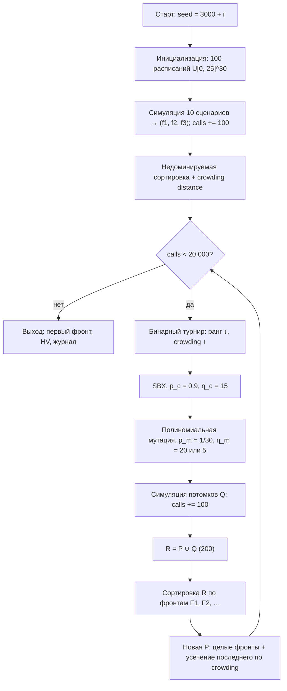
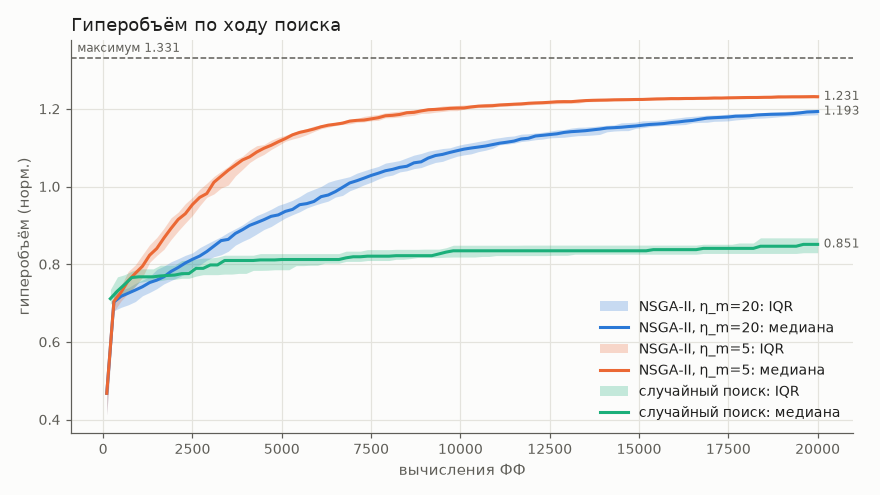
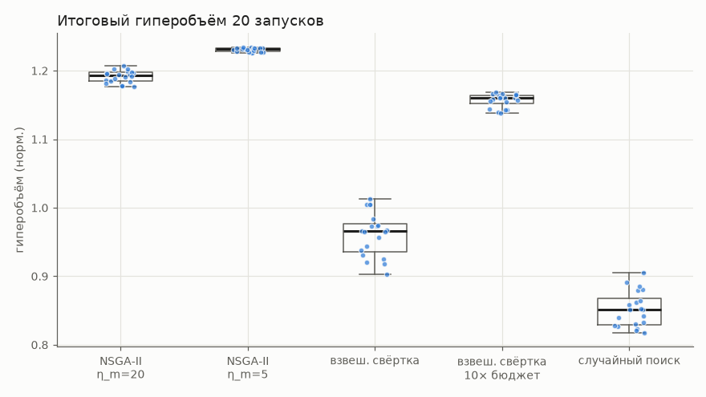
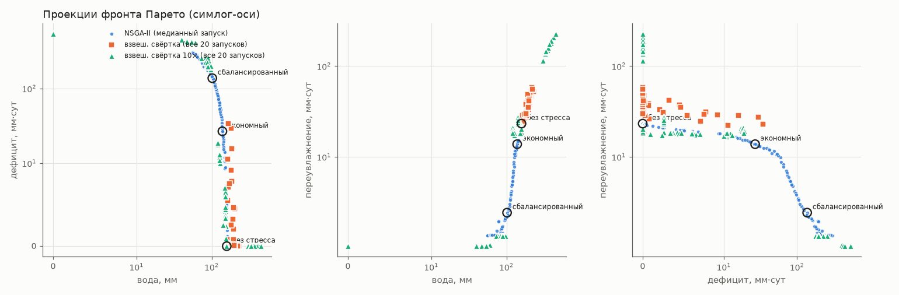
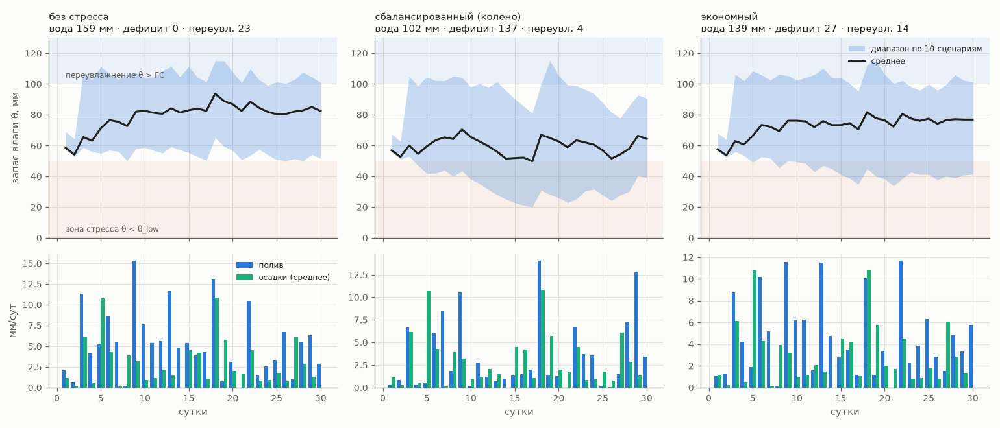

# Отчёт по лабораторной работе № 3

**Курс:** «Эволюционное программирование и генетические алгоритмы», НИЯУ МИФИ
**Тема:** многокритериальная эволюционная оптимизация (трек A): настройка режима полива с помощью собственной реализации NSGA-II
**Вариант:** 5 (группа 517, номер в группе $N = 3$)

---

## 1. Постановка задачи и индивидуальный вариант

$$V = 1 + \big((17\cdot 3 + 7\cdot 1 + 26) \bmod 20\big) = 1 + (84 \bmod 20) = 5.$$

В треке A варианту 5 соответствует задача «**режим полива**» с критериями: min расход воды, min дефицит влаги, min переувлажнение. Требуется составить расписание полива участка на 30 суток вперёд. Все три цели противоречат друг другу: экономия воды ведёт к водному стрессу, а щедрый полив «на всякий случай» ведёт к переувлажнению, если потом пойдёт дождь. Нужен не один «лучший» режим, а **фронт компромиссов**, из которого агроном выберет режим по цене воды и чувствительности культуры к стрессу.

Выполнение требований ЛР3:
1. три противоречивых критерия (общее требование 1);
2. сравнение решений по Парето с оценкой качества фронта гиперобъёмом, отказ от свёртки обоснован экспериментом (разд. 7, 11);
3. результат — фронт из 100 решений и анализ компромиссов (разд. 10);
4. новые механизмы относительно ЛР1–2: недоминируемая сортировка, crowding distance, $(\mu+\lambda)$-отбор по фронтам и **симуляционная фитнес-функция с учётом неопределённости осадков** (ансамбль сценариев, разд. 2.3).

## 2. Формальная модель

### 2.1. Пространство решений

Решение — вектор суточных поливных норм
$$I = (I_1,\dots,I_{30}) \in X = [0,\ 25]^{30}\ \text{мм}.$$
Ограничения — только прямоугольные (максимальная производительность системы 25 мм/сут). Они выполняются по построению: операторы работают с учётом границ (разд. 5), поэтому недопустимых особей нет.

### 2.2. Модель водного баланса («ведро»)

Состояние — запас доступной влаги в корнеобитаемом слое $\theta_t$, мм; $\theta_0 = 60$. За сутки $t$ в сценарии осадков $s$ (`lab3/model.py`):
$$\theta \leftarrow \theta + R_{s,t} + \eta I_t, \qquad \eta = 0.9\ \text{(КПД полива)},$$
$$\theta \leftarrow \theta - K_c\,ET_{0,t}\,\min\!\big(1,\ \theta/\theta_{low}\big)\qquad \text{(эвапотранспирация, снижается при стрессе)},$$
$$\theta \leftarrow \theta - \max(0,\ \theta - \theta_{sat})\qquad \text{(поверхностный сток выше насыщения)},$$
$$\theta \leftarrow \max\!\big(0,\ \theta - k_d \max(0,\ \theta - FC)\big)\qquad \text{(дренаж)}.$$

| параметр | значение | смысл |
|---|---|---|
| $FC$ | 100 мм | полевая влагоёмкость слоя |
| $\theta_{sat}$ | 130 мм | насыщение; выше — сток |
| $\theta_{low}$ | 50 мм | порог водного стресса (50 % легкодоступной влаги) |
| $\theta_0$ | 60 мм | начальный запас |
| $K_c$ | 1.0 | коэффициент культуры |
| $\eta$ | 0.9 | КПД полива |
| $k_d$ | 0.5 | доля излишка над $FC$, уходящая дренажом за сутки |
| $I_{max}$ | 25 мм/сут | верхняя граница нормы |

### 2.3. Критерии (все минимизируются)

$$f_1(I) = \sum_{t=1}^{30} I_t \quad \text{(расход воды, мм)},$$
$$f_2(I) = \frac{1}{K}\sum_{s=1}^{K}\sum_{t=1}^{30}\max\big(0,\ \theta_{low} - \theta_{s,t}\big)\quad \text{(дефицит влаги, мм·сут)},$$
$$f_3(I) = \frac{1}{K}\sum_{s=1}^{K}\sum_{t=1}^{30}\max\big(0,\ \theta_{s,t} - FC\big)\quad \text{(переувлажнение, мм·сут)}.$$

$f_2$ и $f_3$ — интегральные «площади» выхода траектории $\theta$ из агрономического коридора $[\theta_{low}, FC]$ вниз и вверх, усреднённые по $K = 10$ сценариям осадков. Одна оценка особи — векторизованный прогон расписания сразу по всем 10 сценариям; она считается **одним вызовом модели**.

### 2.4. Методическое решение: почему осадки заданы ансамблем

Модель согласована с пользователем. На первом этапе исследования осадки задавались **одним известным прогнозом**. Оказалось, что тогда существует расписание с нулевым дефицитом и нулевым переувлажнением при расходе 106 мм: полив просто «обходит» известный ливень. Критерий $f_3$ ни с чем не конфликтует, его минимум (0) достигается на всей интересной части фронта, и задача **вырождается в двухкритериальную** «вода — дефицит». Это противоречит смыслу варианта.

Физически же расписание составляется **заранее**, а дождь заранее неизвестен. Поэтому модель изменена:
- расписание одно для всех исходов погоды;
- осадки — ансамбль из $K = 10$ сценариев;
- $f_2$, $f_3$ — средние по сценариям.

После этого конфликт стал содержательным. На медианном фронте NSGA-II коэффициент корреляции $f_2$ и $f_3$ равен **−0.89**, воды и дефицита −0.99, воды и переувлажнения +0.94. Полив, спасающий растения от стресса в сухих сценариях, даёт переувлажнение во влажных (со ливнем). Одновременно это механизм «**симуляционная фитнес-функция с учётом неопределённости**» (общее требование 4), дополнительный к недоминируемой сортировке и crowding distance.

## 3. Данные

Файл `lab3/data/weather.json` создаётся скриптом `generate_data.py` (seed 2026):
- **эталонная эвапотранспирация $ET_0$** известна (прогноз): $5 + 1.5\sin(\pi t/29) + \mathcal{N}(0, 0.6^2)$ с обрезкой в $[2, 8.5]$. Жаркая середина периода; фактически $ET_0 \in [4.18, 6.77]$ мм/сут, $\sum ET_0 = 177.6$ мм;
- **осадки**, 10 сценариев: в каждый день дождь с вероятностью 0.2, его объём $\sim \Gamma(0.8, 15)$ мм; кроме того, с вероятностью 0.5 в случайный день выпадает ливень 45 мм;
- сумма осадков по сценариям — от 26 до 147 мм, в среднем 85 мм. Это меньше потребности культуры (≈178 мм), так что полив нужен всегда, но в разной мере.

Без полива дефицит $f_2 = 537.8$ мм·сут, переувлажнение $f_3 = 1.2$. При поливе по максимуму (25 мм каждый день) $f_1 = 750$ мм, $f_2 = 0$, $f_3 = 410.9$ мм·сут. Эти крайние стратегии задают точку надира (разд. 7).

## 4. Представление особи

- **Генотип:** вещественный вектор $x \in [0, 25]^{30}$ (`float64`).
- **Фенотип:** расписание полива — норма $I_t = x_t$ мм в день $t$ — вместе с траекториями влажности $\theta_{s,t}$ по сценариям.
- **Декодирование** тождественное ($I = x$), каждая точка генотипа допустима.

Обоснование: решение по своей природе — 30 непрерывных норм, упорядоченных по времени. Вещественное кодирование не вносит ошибку дискретизации и позволяет использовать операторы, разработанные для непрерывных многокритериальных задач (SBX, полиномиальная мутация). Альтернатива — параметрическая политика вида «поливать до уровня $a$, когда $\theta < b$» — неприменима напрямую, так как по условию расписание фиксируется до наблюдения погоды (см. разд. 13).

## 5. Алгоритм NSGA-II, операторы и параметры

### 5.1. Собственная реализация

NSGA-II реализован без готовых пакетов: примитивы в `evo_core/moo.py`, цикл в `lab3/nsga2.py`.
- **Быстрая недоминируемая сортировка** (Deb et al., 2002) через матрицу доминирования $D_{ij} = [\forall k\ F_{ik}\le F_{jk}] \wedge [\exists k\ F_{ik}<F_{jk}]$. Для каждого решения считается, сколько решений его доминируют. Нулевые — первый фронт; их «вклад» вычитается, и процедура повторяется.
- **Crowding distance:** внутри фронта по каждому критерию точки упорядочиваются, и к расстоянию добавляется нормированная разность соседей $(F_{i+1,k}-F_{i-1,k})/(F_{\max,k}-F_{\min,k})$. Крайние точки получают $\infty$ и никогда не теряются.
- **Селекция:** бинарный турнир по crowded comparison: меньший ранг, при равном ранге — большее crowding distance.
- **Отбор $(\mu+\lambda)$:** из $P\cup Q$ (200 особей) целиком берутся фронты, пока они помещаются. Последний фронт усекается по убыванию crowding distance.

Псевдокод:
```
P ← 100 равномерно случайных расписаний; F ← модель(P)            # 100 вызовов
(ранги, crowd) ← отбор(P)
пока вызовов < 20 000:
    родители ← бинарный турнир по (ранг ↑, crowd ↓), 100 шт.
    Q ← SBX(пары, p_c = 0.9, η_c = 15) ; Q ← полиномиальная мутация(η_m, p_m = 1/30)
    F_Q ← модель(Q)                                                 # 100 вызовов
    R ← P ∪ Q ; фронты ← недоминируемая_сортировка(F_R)
    P ← целые фронты, последний — по убыванию crowding distance, до 100 особей
результат ← недоминируемые точки первого фронта P
```
Бюджет $100 + 199\cdot 100 = 20\,000$ вызовов, т. е. 199 поколений.

### 5.2. Блок-схема



### 5.3. Операторы и обоснование относительно структуры задачи

- **SBX** (simulated binary crossover), $\eta_c = 15$, $p_c = 0.9$ на пару; каждый ген скрещивается с вероятностью 0.5. Потомки симметричны относительно среднего родителей, т. е. суммарный объём воды пары в среднем сохраняется (проверено тестом `test_sbx_preserves_parent_mean`). Это важно, так как $f_1$ линеен по генам. Покомпонентное смешивание переносит удачные «дневные» решения (полить перед жарой, не лить перед вероятным ливнем) между расписаниями.
- **Полиномиальная мутация Деба** с учётом границ, $p_m = 1/d = 1/30$ (в среднем один изменённый день), $\eta_m = 20$ (базовая) или 5. Распределение шага сжато к нулю, но ограничено интервалом $[0, 25]$, поэтому выход за границы невозможен (тест `test_operators_respect_bounds`). Норма 0 («не поливать») достижима, что важно для экономных режимов.
- **Crowding distance** нужна именно здесь: без неё фронт стягивается к «середине», а агроному нужны и экономные, и безопасные режимы.
- **Инициализация** равномерная в $[0,25]^{30}$. Стартовые расписания в среднем расходуют 375 мм и сильно переувлажняют почву, поэтому первые поколения — это спуск к фронту.

### 5.4. Таблица параметров (из `lab3/configs/*.toml`)

| параметр | `nsga2` | `nsga2_eta5` | `weighted_sum` | `weighted_sum_10x` | `random_search` |
|---|---|---|---|---|---|
| метод | NSGA-II | NSGA-II | свёртка + однокрит. ГА | свёртка + однокрит. ГА | случайный поиск + архив |
| популяция | 100 | 100 | 40 на вектор | 40 на вектор | порции по 100 |
| бюджет вызовов модели | 20 000 | 20 000 | 20 000 (10 × 2 000) | **200 000** (10 × 20 000) | 20 000 |
| селекция | crowded-турнир | = | турнир $k=2$, элита 2 | = | — |
| кроссовер | SBX, $\eta_c=15$, $p_c=0.9$ | = | = | = | — |
| мутация | полином., $\eta_m=20$, $p_m=1/30$ | $\eta_m=$ **5** | $\eta_m=20$ | $\eta_m=20$ | — |
| отбор | $(\mu+\lambda)$ по фронтам | = | поколенческий с элитой | = | архив недоминируемых |
| веса | — | — | Das—Dennis, $h=3$, 10 векторов | = | — |
| остановка | лимит вызовов | = | = | = | = |
| ограничения | границы в операторах | = | = | = | по построению |
| запуски / seed | 20 / 3000…3019 | = | = | = | = |

Все конфигурации используют одну модель (`[model]`) и одинаковую метрику ($HV$, опорная точка 1.1).

## 6. Проверка корректности реализации

- `tests/test_moo.py`: недоминируемая сортировка сверена с **полным перебором** попарных сравнений на случайных наборах; crowding distance даёт $\infty$ крайним точкам; гиперобъём сверен с аналитическими значениями (2D/3D) и с оценкой **Монте-Карло** в 3D.
- `lab3/tests/test_lab3.py`:
  - **баланс массы воды** сходится точно: $\theta_0 + \sum(R + \eta I) = \theta_{30} + \sum(ET + \text{сток} + \text{дренаж})$;
  - монотонность критериев на крайних расписаниях;
  - SBX и мутация не выходят за границы, SBX сохраняет среднее родителей;
  - отбор сохраняет первый фронт и крайние точки;
  - решётка весов лежит на симплексе;
  - NSGA-II воспроизводим по seed, расходует ровно 20 000 вызовов и возвращает взаимно недоминируемое множество.

## 7. Способ сравнения решений и метрика качества

**Внутри алгоритма** решения сравниваются только по Парето: $x \succ y \iff \forall k\ f_k(x)\le f_k(y) \wedge \exists k\ f_k(x)<f_k(y)$. Критерии имеют разные единицы (мм и мм·сут), а «цена» стресса и переувлажнения зависит от культуры и стоимости воды, которые на этапе поиска неизвестны. Парето-подход не требует задавать эти предпочтения заранее: выбор делается **после** поиска, на готовом фронте (разд. 10). Взвешенная свёртка требует априорных весов и нормировки. Кроме того, она находит лишь точки выпуклой оболочки фронта и по одной точке на вектор весов (разд. 11).

**Между алгоритмами** фронты сравниваются по **гиперобъёму** — единственной широко используемой унарной метрике, строго монотонной по Парето-доминированию. Если фронт A доминирует фронт B, то $HV(A) > HV(B)$. Одновременно метрика учитывает и близость к истинному фронту, и его охват.
- Критерии нормируются как $f/\text{nadir}$, где $\text{nadir} = (750,\ 537.8,\ 410.9)$ — худшие значения на крайних стратегиях (вода и переувлажнение — полив по максимуму, дефицит — без полива).
- Опорная точка — 1.1 по каждой оси, так что крайние решения тоже дают вклад. Максимально возможный $HV = 1.1^3 = 1.331$.
- $HV$ считается **точно** собственным алгоритмом: в 2D — заметанием по первой оси, в 3D — послойно по третьему критерию (сумма площадей 2D-срезов на толщину слоя).

Статистика — по 20 независимым запускам на метод, значимость — двусторонний U-тест Манна—Уитни.

**Методика эксперимента.** Все методы получают одинаковую модель, одинаковый бюджет вызовов модели (кроме явно помеченной 10×-свёртки как верхней оценки свёртки) и одинаковые seed 3000…3019. Остановка — только по лимиту вызовов; счётчик `Evaluator` не допускает превышения. Для NSGA-II HV логируется каждые 2 поколения (`*_gens.csv`), что даёт кривые сходимости рис. 1.

## 8. Результаты серий (20 запусков на конфигурацию)

### 8.1. Гиперобъём (`results/summary.md`; больше — лучше)

| метод | HV best | HV mean | HV median | HV std | HV worst | точек фронта (медиана) | время/запуск, с | вызовов модели |
|---|---|---|---|---|---|---|---|---|
| NSGA-II, $\eta_m=20$ | 1.2073 | 1.1915 | 1.1932 | 0.0088 | 1.1763 | 100 | 0.557 | 20 000 |
| NSGA-II, $\eta_m=5$ | **1.2343** | **1.2306** | **1.2313** | **0.0028** | **1.2253** | 100 | 0.612 | 20 000 |
| взвешенная свёртка | 1.0134 | 0.9615 | 0.9656 | 0.0320 | 0.9026 | 2 | 0.214 | 20 000 |
| взвешенная свёртка, 10× бюджет | 1.1683 | 1.1566 | 1.1601 | 0.0099 | 1.1378 | 10 | 2.143 | 200 000 |
| случайный поиск | 0.9056 | 0.8521 | 0.8511 | 0.0259 | 0.8178 | 2 | 0.147 | 20 000 |

Все решения допустимы по построению (доля допустимых 100 %). Все 40 запусков NSGA-II находят решение с нулевым дефицитом.

### 8.2. U-тест Манна—Уитни по HV ($n_1 = n_2 = 20$; $z>0$ — A лучше)

| A vs B | HV медиана A | HV медиана B | U | z | p |
|---|---|---|---|---|---|
| NSGA-II, $\eta_m=20$ vs взвешенная свёртка | 1.1932 | 0.9656 | 400 | 5.41 | $6.3\cdot10^{-8}$ |
| NSGA-II, $\eta_m=20$ vs свёртка, 10× бюджет | 1.1932 | 1.1601 | 400 | 5.41 | $6.3\cdot10^{-8}$ |
| NSGA-II, $\eta_m=20$ vs случайный поиск | 1.1932 | 0.8511 | 400 | 5.41 | $6.3\cdot10^{-8}$ |
| NSGA-II, $\eta_m=5$ vs NSGA-II, $\eta_m=20$ | 1.2313 | 1.1932 | 400 | 5.41 | $6.3\cdot10^{-8}$ |

$U = 400$ во всех парах означает полное разделение выборок: худший запуск A лучше лучшего запуска B.

### 8.3. Графики


*Рис. 1. Гиперобъём первого фронта по ходу поиска (медиана и IQR по 20 запускам). Пунктир — теоретический максимум 1.331. Случайный поиск останавливается на ≈0.85 уже к ~5 000 вызовов. NSGA-II с $\eta_m=5$ выходит на плато ≈1.23 к ~12 000 вызовов, с $\eta_m=20$ к концу бюджета ещё растёт.*


*Рис. 2. Распределение итогового HV 20 запусков по методам. Оба варианта NSGA-II полностью отделены от свёртки (даже с 10-кратным бюджетом) и от случайного поиска.*


*Рис. 3. Попарные проекции трёхмерного фронта (симлог-оси): медианный запуск NSGA-II (синие точки) против объединения фронтов свёртки по 20 запускам (оранжевые — равный бюджет, зелёные — 10× бюджет). Кружками отмечены характерные решения из разд. 10.*


*Рис. 4. Три характерных решения. Сверху — запас влаги $\theta$: среднее по сценариям и коридор min…max по 10 сценариям; красная зона — стресс ($\theta<50$), синяя — переувлажнение ($\theta>100$). Снизу — поливные нормы и средние осадки по дням.*

## 9. Визуализация фронта из трёх критериев

Трёхмерный фронт показан тремя способами:
- попарными проекциями (рис. 3);
- таблицей характерных решений (разд. 10);
- траекториями влажности для этих решений (рис. 4).

Фронт медианного запуска $\eta_m=20$ содержит 100 точек с диапазонами $f_1 \in [56.0,\ 165.1]$ мм, $f_2 \in [0,\ 301.9]$ мм·сут, $f_3 \in [2.2,\ 23.3]$ мм·сут. Срез по воде (каждая 10-я точка):

| вода, мм | 56.0 | 74.2 | 84.9 | 101.0 | 112.3 | 122.2 | 131.1 | 139.0 | 148.8 | 158.5 |
|---|---|---|---|---|---|---|---|---|---|---|
| дефицит, мм·сут | 301.9 | 230.3 | 199.4 | 143.0 | 103.2 | 74.6 | 45.4 | 26.1 | 9.3 | 0.0 |
| переувл., мм·сут | 2.2 | 2.2 | 2.4 | 4.1 | 5.9 | 8.2 | 11.0 | 13.9 | 18.1 | 23.3 |

Фронт по существу одномерная кривая в трёхмерном пространстве: при движении вдоль неё вода и переувлажнение растут, а дефицит падает. Предельная «цена» снижения дефицита в воде растёт к концу фронта. От 56 до 122 мм каждый миллиметр воды снимает ≈3–4 мм·сут дефицита, от 139 до 158 мм — лишь ≈1 мм·сут при одновременном росте переувлажнения. Кривая «вода — дефицит» в целом **выпуклая**, но в средней части близка к линейной. На плотной сетке весов лишь 38 из 100 точек фронта являются минимумами какой-либо взвешенной суммы. Остальные лежат в «прогибах» или на почти линейных участках и свёрткой практически недостижимы.

## 10. Характерные решения и их предметный смысл

Решения взяты из запуска NSGA-II ($\eta_m=20$) с **медианным** HV, а не с лучшим. Это принципиально: таблица описывает типичный результат метода, а не удачный seed.

| решение | правило выбора | вода, мм | дефицит, мм·сут | переувлажнение, мм·сут | поливов (> 0.5 мм) |
|---|---|---|---|---|---|
| **без стресса** («надёжный») | $f_2 = 0$, минимум среди таких | 158.6 | 0.0 | 23.3 | 28 |
| **сбалансированный** (колено) | ближайшая к идеальной точке после нормировки на размах фронта | 101.9 | 137.4 | 4.5 | 24 |
| **экономный** | минимум воды при $f_2 \le 5\,\%$ от дефицита без полива (≤ 26.9) | 138.9 | 26.7 | 13.8 | 28 |

Смысл:
- **Без стресса** — для культур, чувствительных к недостатку влаги (овощи, фаза цветения), и дешёвой воды. Ни в одном из 10 сценариев $\theta$ не опускается ниже порога стресса (рис. 4, слева). Плата — 159 мм воды и переувлажнение 23 мм·сут: в сценариях с ливнем запас долго держится выше $FC$, вода уходит в дренаж, растёт риск вымывания удобрений и гипоксии корней.
- **Экономный** — практический компромисс: на 20 мм (12 %) меньше воды, чем «без стресса», при остаточном дефиците около 5 % от дефицита без полива. В сухих сценариях $\theta$ лишь кратковременно касается зоны стресса, переувлажнение на 40 % ниже. Подходит при умеренной цене воды и засухоустойчивой культуре.
- **Сбалансированный (колено)** — режим при дорогой или лимитированной воде: 102 мм, почти нет переувлажнения (4.5), но заметный стресс (137 мм·сут, ≈26 % от дефицита без полива). В сухих сценариях $\theta$ опускается до 20–30 мм (рис. 4, в центре). Большой стресс у «колена» — свойство выбранного правила, а не ошибка. Нормировка на размах фронта уравнивает оси, а размах дефицита (0…302) велик по сравнению с размахом переувлажнения (2…23). Поэтому «геометрически середина» оказывается в зоне заметного стресса. Для конкретной культуры агроном мог бы задать другие масштабы.

Общее по рис. 4: у сценариев **без ливня** угрожает стресс (нижняя граница коридора), у сценариев **с ливнем** — переувлажнение (верхняя граница). Коридор $\theta$ по сценариям широкий (до 60–80 мм). Именно эта неопределённость и делает $f_2$ и $f_3$ конфликтующими: никакое заранее заданное расписание не удерживает все 10 сценариев в коридоре $[50, 100]$ одновременно.

## 11. Сравнение со взвешенной суммой

**Постановка.** 10 векторов весов на симплексе (решётка Das—Dennis, $h = 3$: $w_k \in \{0, 1/3, 2/3, 1\}$, $\sum w_k = 1$). Для каждого вектора свой однокритериальный ГА минимизирует $\sum_k w_k f_k/\text{nadir}_k$. Операторы те же (SBX, полиномиальная мутация), плюс турнир $k = 2$ и элитизм 2 особи. Итог запуска — недоминируемые из 10 лучших решений.

Векторы весов и что они означают:

| $w = (w_1, w_2, w_3)$ | число | что оптимизируется |
|---|---|---|
| $(1,0,0)$, $(2/3,0,1/3)$, $(1/3,0,2/3)$ | 3 | вода и/или переувлажнение без учёта стресса → «не поливать» |
| $(0,1,0)$ | 1 | только дефицит → любой полив без стресса, вода не штрафуется |
| $(0,0,1)$ | 1 | только переувлажнение → вода и дефицит не штрафуются, решение произвольно среди почти не поливающих |
| $(2/3,1/3,0)$, $(1/3,2/3,0)$, $(0,2/3,1/3)$, $(0,1/3,2/3)$, $(1/3,1/3,1/3)$ | 5 | содержательные компромиссы |

Из 10 векторов только половина даёт невырожденные компромиссы.
Остальные тратят свою долю бюджета на крайние или слабо Парето-оптимальные точки.
Увеличение $h$ помогает лишь отчасти: число векторов растёт как $C(h+2,2)$, а бюджет на каждый падает.

**Результаты.**
- При **равном общем бюджете** (2 000 вызовов на вектор) медиана HV 0.966 против 1.193 у NSGA-II. После фильтрации недоминируемых остаётся медианно 2 точки (от 1 до 5). ГА на 2 000 вызовов не успевает сойтись, и большинство его решений доминируются друг другом.
- Даже при **10-кратном бюджете** (20 000 на вектор, 200 000 всего, в 3.8 раза дольше по времени) HV 1.160 < 1.193, $p = 6.3\cdot10^{-8}$. Точек 10 (в двух запусках 9), но около трёх из них — одинаковые копии решения «без полива» (см. ниже), так что различных точек ≈8.

**Почему свёртка проигрывает:**
1. **Один вектор весов — одна точка.** 10 векторов дают не более 10 решений вместо 100. Фронт между ними не покрыт (рис. 3: зелёные точки редкими группами).
2. **Нулевые веса дают вырожденные крайние решения.**
   - $w = (0, 1, 0)$ не штрафует воду и переувлажнение. ГА находит любое расписание с нулевым дефицитом, и на практике это 306–454 мм воды и переувлажнение 115–226 мм·сут (в первых запусках 370–390 мм и ≈170–180). Такая точка лишь слабо Парето-оптимальна: её доминирует решение «без стресса» NSGA-II (158.6 / 0 / 23.3).
   - Векторы с $w_2 = 0$, $w_1 > 0$ (три штуки) все дают одно решение «не поливать»: 0 / 537.8 / 1.2. Треть бюджета уходит на одну точку.
3. **Только выпуклая оболочка.** Минимизатор взвешенной суммы всегда лежит на выпуклой оболочке фронта. Точки в «прогибах» и на почти линейных участках недостижимы при любых весах, а на линейных участках малое изменение весов перебрасывает решение с одного конца отрезка на другой (разд. 9: лишь 38 % точек фронта поддерживаемые).
4. **Разные единицы.** Мм воды и мм·сут стресса несопоставимы. Без нормировки на nadir веса бессмысленны, а с ней результат зависит от выбора нормировки, т. е. от ещё одного произвольного решения.

Достоинство свёртки — её точки близки к фронту (лишь ≈10 % точек 10×-свёртки доминируются медианным фронтом NSGA-II). Свёртка также достигает крайней точки «не поливать», которую NSGA-II с $\eta_m=20$ не находит. Но как способ **построить** фронт она неэффективна: нужно в 10 раз больше вычислений ради меньшего числа точек.

## 12. Анализ и выводы

**Влияние параметра мутации ($\eta_m$, один фактор).** При $\eta_m = 5$ медиана HV 1.231 против 1.193 ($U = 400$, $p = 6.3\cdot10^{-8}$). Разброс по запускам втрое меньше (std 0.0028 против 0.0088), плато достигается раньше (рис. 1). Меньшее $\eta_m$ даёт более широкое распределение шага мутации. В 30-мерном пространстве с бюджетом всего 199 поколений это ускоряет перемещение вдоль фронта. Особенно заметно на экономном конце: медианный по запускам минимум воды на фронте 11.7 мм при $\eta_m = 5$ против 63.9 мм при $\eta_m = 20$ (`*_summary.csv`, столбец `min_water`). Значит, основной вклад в прирост HV — **охват** фронта в сторону малых норм, а не только его сдвиг. Стандартное $\eta_m = 20$ рассчитано на тонкую доводку и при ограниченном бюджете не успевает «растянуть» фронт.

**NSGA-II против случайного поиска.** Случайный поиск с архивом даёт HV 0.851 и фронт из 1–5 точек (медиана 2). Равномерное расписание в $[0,25]^{30}$ в среднем расходует 375 мм воды и сильно переувлажняет почву. Даже лучшие из 20 000 случайных решений (≈220–230 мм, переувлажнение 50–65) далеки от фронта. Хорошие расписания составляют исчезающе малую долю пространства, и нужен направленный поиск.

**Модель и постановка.** Главный содержательный результат — роль неопределённости. При известных осадках третий критерий вырождается (разд. 2.4). При ансамбле сценариев возникает настоящий трёхкритериальный компромисс: переувлажнение — неизбежная плата за защиту от стресса в сухих сценариях.

Выводы:
1. Собственный NSGA-II строит фронт из 100 компромиссных режимов за 0.6 с и с полным разделением выборок превосходит взвешенную свёртку — и при равном, и при 10-кратном бюджете — а также случайный поиск.
2. Параметр $\eta_m$ существенно влияет на качество при ограниченном бюджете: $\eta_m = 5$ значимо лучше $\eta_m = 20$ и стабильнее, в первую очередь за счёт охвата экономного края фронта.
3. Взвешенная свёртка ограничена принципиально: одна точка на вектор весов, вырожденные решения при нулевых весах, только выпуклая оболочка, зависимость от нормировки.
4. Учёт неопределённости осадков необходим для содержательной постановки: без него критерий переувлажнения тривиален.

## 13. Почему результат хороший для этой задачи

- Задача многокритериальная, и **ответ — это фронт**, а не одна точка. NSGA-II даёт 100 равномерно распределённых режимов от 56 до 165 мм, от «экономного со стрессом» до «без стресса». Агроном выбирает по цене воды и чувствительности культуры, не перезапуская оптимизацию.
- Качество подтверждено **серией** из 20 запусков с малым разбросом (std HV 0.009 и 0.003) и U-тестами с полным разделением выборок, а не единичным удачным запуском.
- Фронт близок к достижимому: HV 1.231 при теоретическом максимуме 1.331. Максимум соответствовал бы недостижимой «утопии» 0/0/0, так что реальный фронт по определению меньше. На рис. 1 кривая $\eta_m=5$ вышла на плато, дальнейшее увеличение бюджета почти ничего не даёт.
- Характерные решения физически осмысленны и согласуются с агрономической интуицией: безопасный режим требует ≈160 мм при потребности культуры ≈178 мм и средних осадках 85 мм (запас воды нужен против сухих сценариев), экономный — на 12 % меньше при малом стрессе.
- Реализация проверена независимо (перебор, аналитика, Монте-Карло, баланс массы).

Результат **приемлем, но не идеален** в двух отношениях. Базовая конфигурация ($\eta_m = 20$) не охватывает экономный край фронта и к концу бюджета ещё не сошлась. Сами расписания неудобны для исполнения (разд. 14).

## 14. Ограничения и возможные улучшения

Ограничения:
- **«Шумные» расписания.** Эволюционные режимы поливают почти каждый день малыми нормами (24–28 поливов из 30, рис. 4). Модель не штрафует число включений и не различает 30 поливов по 5 мм и 6 по 25 мм, поэтому случайная «мелкая рябь» не отсеивается.
- **Упрощённая модель.** «Ведро» с суточным шагом не учитывает профиль почвы, капиллярный подъём, зависимость $K_c$ от фазы развития и связь стресса с урожаем.
- **Малая выборка неопределённости.** 10 сценариев — грубая оценка распределения осадков; средние $f_2$, $f_3$ чувствительны к конкретным сценариям (ливень в 5 из 10). Не оценивалась устойчивость фронта на независимых сценариях (out-of-sample).
- **Зависимость HV от нормировки и опорной точки.** Другой выбор nadir или опорной точки мог бы изменить разности между методами (хотя вряд ли их порядок при полном разделении выборок).

Возможные улучшения:
- четвёртый критерий или штраф за число поливов; либо параметрическая политика (пороги и нормы по неделям) вместо 30 независимых норм;
- риск-ориентированные критерии: CVaR или худший сценарий вместо среднего; больше сценариев с проверкой на отложенных;
- адаптивное $\eta_m$ или самоадаптация шага мутации; сравнение с MOEA/D или SMS-EMOA;
- более реалистичная модель (FAO-56 с фазами $K_c$, два слоя почвы).

## 15. Воспроизведение

Команды выполняются из корня репозитория; установка описана в `lab1/README.md`.

```bash
.venv/bin/python -m lab3.generate_data --seed 2026                     # ET0 и 10 сценариев осадков -> data/weather.json
.venv/bin/python -m lab3.main --config lab3/configs/*.toml              # 5 конфигураций × 20 запусков, ~75 с
.venv/bin/python -m lab3.main --config lab3/configs/nsga2.toml --seed 42 --runs 20   # своя серия
.venv/bin/python -m lab3.analyze --plots                                # HV, U-тесты, проекции, характерные решения
.venv/bin/python -m pytest lab3 tests/test_moo.py                                 # тесты
```

Где лежат результаты (`lab3/results/`):
- HV по запускам — `*_summary.csv`; HV по поколениям — `*_gens.csv`;
- итоговые фронты всех запусков — `*_fronts.csv`;
- фронт и расписания медианного запуска — `*_median_front.csv`;
- фактические конфигурации — `*_config.json`; сводка — `summary.md`.

## 16. Ответы на вопросы к защите (ЛР3)

1. **Какие критерии и почему они противоречивы?** Вода, средний дефицит и среднее переувлажнение. Больше воды — меньше стресс, но больше переувлажнение во влажных сценариях. На фронте корреляции −0.99 (вода — дефицит) и −0.89 (дефицит — переувлажнение).
2. **Как сравниваются решения?** По Парето-доминированию внутри алгоритма; фронты разных методов — по гиперобъёму в нормированных координатах. Свёртка отвергнута, так как требует априорных весов и видит только выпуклую оболочку (разд. 7, 11).
3. **Что такое фронт Парето и как он визуализирован?** Множество недоминируемых решений. Для трёх критериев — попарные проекции (рис. 3), таблица-срез (разд. 9) и характерные решения с траекториями влажности (рис. 4).
4. **Зачем недоминируемая сортировка и crowding distance?** Сортировка задаёт давление к фронту без весов. Crowding distance поддерживает равномерность и сохраняет крайние точки ($\infty$), чтобы фронт не стягивался в одну область.
5. **Почему реализация NSGA-II своя и как проверена?** Готовые реализации запрещены заданием. Сортировка сверена с полным перебором, HV — с аналитикой и Монте-Карло, NSGA-II — на воспроизводимость, соблюдение бюджета и недоминируемость результата.
6. **Какой механизм новый по сравнению с ЛР1–2?** Недоминируемая сортировка, crowding distance, $(\mu+\lambda)$-отбор по фронтам и симуляционная ФФ, усредняющая критерии по ансамблю сценариев погоды.
7. **Почему осадки — ансамбль, а не один прогноз?** При известном прогнозе полив обходит ливень, находится решение с $f_2 = f_3 = 0$ (106 мм), и задача вырождается в двухкритериальную. Расписание же составляется заранее, при неизвестном дожде.
8. **Как выбраны характерные решения?** Формальными правилами на фронте медианного по HV запуска: минимум воды при нулевом дефиците; минимум воды при дефиците ≤ 5 % от дефицита без полива; ближайшая к идеальной точке после нормировки на размах («колено»).
9. **Почему взвешенная сумма хуже?** Одна точка на вектор весов, вырожденные решения при нулевых весах, недостижимость невыпуклых и линейных участков, зависимость от нормировки. Даже при 10-кратном бюджете HV 1.160 < 1.193.
10. **Какой параметр влияет на результат?** $\eta_m$: при $\eta_m = 5$ HV 1.231 против 1.193 ($p = 6.3\cdot10^{-8}$) и втрое меньше разброс — за счёт более широких шагов и лучшего охвата экономного края фронта.
11. **Как обеспечена воспроизводимость и честность сравнения?** Данные — seed 2026, запуски — seed 3000–3019. Всем методам одинаковый бюджет 20 000 вызовов (кроме явно помеченной 10×-свёртки) и одинаковая метрика; счётчик вызовов не допускает превышения.
12. **Почему ЭА оправдан?** Критерии — результат нелинейной симуляции с порогами (сток, дренаж, $\min(1,\theta/\theta_{low})$), градиентов в явном виде нет. Нужен весь фронт за один запуск, что популяционный метод даёт естественно.
