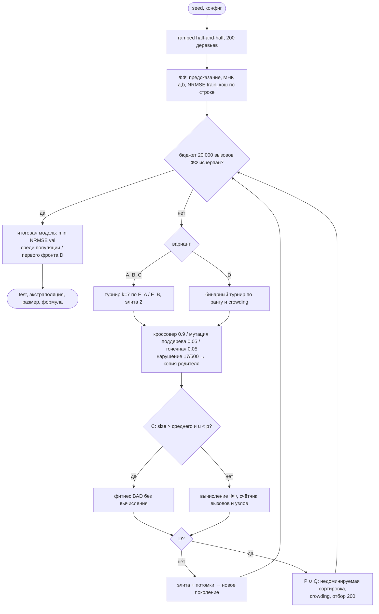
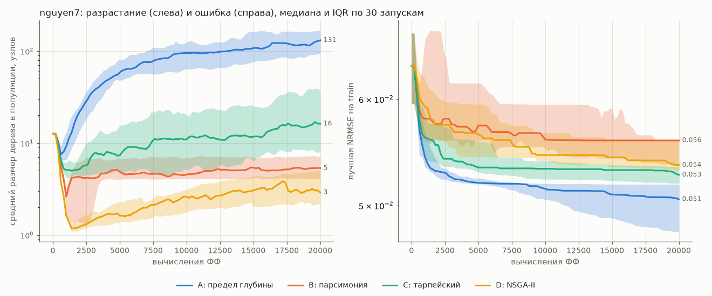
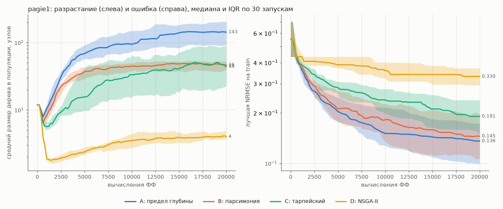
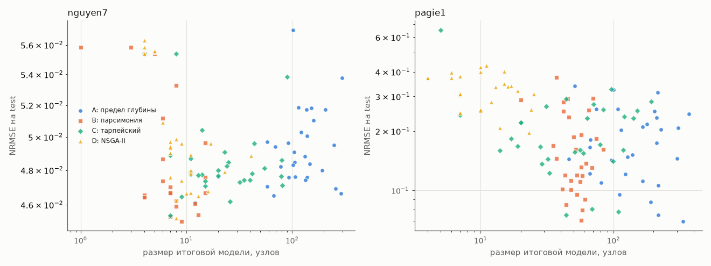
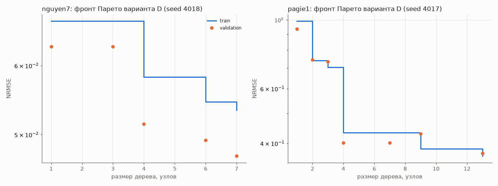
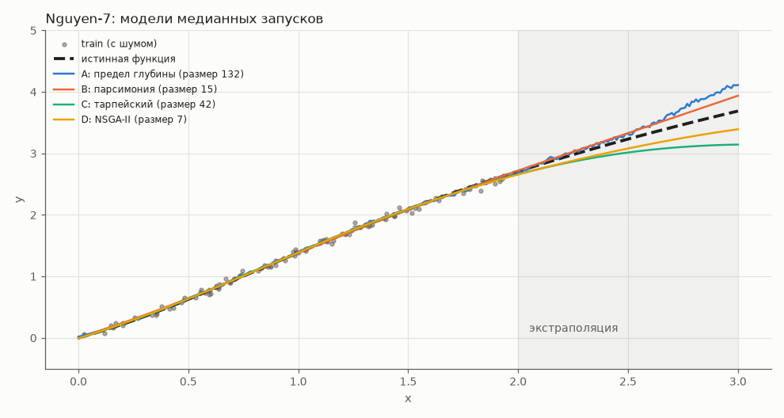
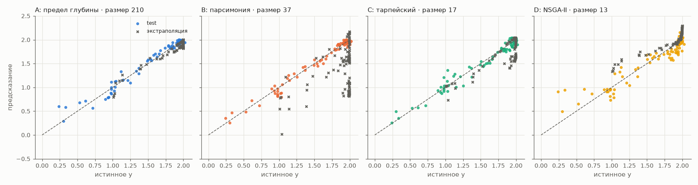

# Отчёт по лабораторной работе № 4 (проект «со звёздочкой»)

**Курс:** «Эволюционное программирование и генетические алгоритмы», НИЯУ МИФИ
**Тема (вариант 5):** эволюционный поиск формул для символьной регрессии с контролем разрастания деревьев (bloat)
**Исследовательский вопрос:** какой механизм контроля разрастания даёт лучший компромисс между точностью, размером модели и стоимостью вычислений при равном бюджете?

---

## 0. Заявка и отличия реализации от неё

Заявка (обязательное требование 1 ЛР4) — [`PROPOSAL.md`](PROPOSAL.md). Она подготовлена 18.09.2026 до начала реализации и согласована по объёму (4 варианта × 2 задачи) перед написанием кода; преподавателю представляется вместе с работой. Заявка содержит постановку, представление, алгоритм, данные, критерии оценки и риски. Реализация следует заявке: тот же язык функций, две задачи (Nguyen-7, Pagie-1), шум 5 %, разбиение 60/20/20, четыре механизма A–D, 30 запусков, U-тест с поправкой Холма и $\hat A_{12}$. Отличия следующие.

| пункт заявки | реализация | почему |
|---|---|---|
| бюджет «20 000 оценок = популяция 200 × 100 поколений» | критерий остановки — **лимит 20 000 вычислений ФФ**, число поколений не фиксировано. У A и B это ровно 100 поколений, у D 99 (NSGA-II оценивает 200 потомков за поколение), у C медианно 134 (Nguyen-7) и 138 (Pagie-1) | тарпейский метод не вычисляет «убитых» особей; при фиксированном числе поколений он потратил бы меньше вычислений, и сравнение было бы нечестным в обратную сторону (разд. 8.2) |
| «компиляция в numpy-выражение с кэшем по строке» | кэш по строковому коду дерева хранит **только ошибки** (NRMSE на 4 разбиениях и коэффициенты $a, b$), а не векторы предсказаний | память; предсказания нужны лишь для итоговых графиков и пересчитываются |
| «проверяется экстраполяция» | точки экстраполяции **без шума** и вне обучающего куба | измеряется отклонение от истинной закономерности, а не от шума |
| $\div_{prot}(a,0)=1$, $\log_{prot}(0)=0$, $\exp$ ограничена сверху | порог $|b|\le 10^{-9}$ и $|a|\le10^{-9}$; аргумент $\exp$ обрезается в $[-50, 20]$ | уточнение, смысл не изменён |
| $c$ подбирается на отдельных seed | подобраны и $c$, и $p$ тарпейского метода на seed 100–102 (`tune.py`) | риск чувствительности есть у обоих параметров |

Прогноз времени из заявки (5–10 мин на полный набор) подтвердился: 509 с по `run_log.txt`.

## 1. Постановка и индивидуальный вариант

Дана выборка $D=\{(\mathbf x_j, y_j)\}$, $y = g(\mathbf x)+\varepsilon$, функция $g$ неизвестна. Нужно найти формулу $h\in\mathcal L$, которая (1) точно предсказывает $y$ на **новых** данных и (2) компактна, т. е. интерпретируема.

Генетическое программирование (ГП) решает задачу поиском в пространстве деревьев выражений. Его известная патология — **bloat**: средний размер деревьев растёт без соответствующего улучшения ошибки. Причины — нейтральные «интроны» (например, `x - x`, `sin(sin(sin(…)))`), которые защищают полезный код от разрушения кроссовером, и асимметрия операторов в сторону роста [Luke, Panait 2006]. Разрастание (а) квадратично замедляет вычисление ФФ, (б) делает формулу нечитаемой, (в) способствует подгонке под шум.

Сравниваются 4 механизма контроля при **одинаковых** языке, операторах, данных и бюджете (требования 2–3):

| вариант | конфиг | механизм |
|---|---|---|
| **A** | `gp_depth.toml` | только жёсткие пределы: глубина 17 [Koza 1992], размер 500 — эталон |
| **B** | `gp_parsimony.toml` | парсимония: $F = \mathrm{NRMSE}+c\cdot\mathrm{size}$, $c=10^{-3}$ |
| **C** | `gp_tarpeian.toml` | тарпейский метод [Poli 2003], $p=0.6$ |
| **D** | `gp_nsga2.toml` | двухкритериальный NSGA-II по (NRMSE, size), ядро `evo_core/moo.py` из ЛР3 |

Соответствие ожидаемому уровню ЛР4: несколько взаимосвязанных компонентов (язык и защищённая семантика, генерация и вариация деревьев, линейное масштабирование, кэш, 4 режима отбора, собственный NSGA-II, статистика), сравнение нескольких архитектур поиска, 30 запусков, воспроизводимость по seed.

## 2. Формальная модель

**Язык.** $\mathcal L$ — множество конечных деревьев над
$$\mathcal F=\{+,-,\times,\div_{p},\sin,\cos,\exp_{p},\log_{p}\},\qquad \mathcal T=\{x_1,\dots,x_d\}\cup\{c\in[-1,1]\},$$
$$\div_p(a,b)=\begin{cases}a/b,&|b|>10^{-9}\\1,&\text{иначе}\end{cases},\quad
\log_p(a)=\begin{cases}\ln|a|,&|a|>10^{-9}\\0,&\text{иначе}\end{cases},\quad
\exp_p(a)=e^{\min(\max(a,-50),20)}.$$
Все функции определены на всей $\mathbb R$, поэтому **любое** синтаксически корректное дерево задаёт всюду определённую функцию $h:\mathbb R^d\to\mathbb R$ (за исключением переполнений в произведениях, см. ниже).

**Пространство решений:** $X=\{h\in\mathcal L:\ \mathrm{depth}(h)\le 17,\ \mathrm{size}(h)\le 500\}$ (глубина корня 0, размер — число узлов). $X$ конечно, но астрономически велико.

**Линейное масштабирование** [Keijzer 2003]. Модель — $\hat y = a + b\,h(\mathbf x)$, где $a,b$ — МНК на train:
$$b=\frac{\operatorname{cov}(h,y)}{\operatorname{var}(h)},\quad a=\bar y-b\,\bar h\qquad(b=0,\ \text{если}\ \operatorname{var}(h)<10^{-12}).$$
ГП ищет только **форму** зависимости, масштаб и сдвиг получаются аналитически.

**Критерии.** Ошибка на разбиении $S$:
$$\mathrm{NRMSE}_S(h)=\frac{1}{\sigma_{y,\text{train}}}\sqrt{\frac{1}{|S|}\sum_{j\in S}\big(a+b\,h(\mathbf x_j)-y_j\big)^2},$$
нормировка на $\sigma_y$ train делает ошибку безразмерной: 1 — уровень константной модели, $\approx0.05$ — уровень шума. Второй критерий — $\mathrm{size}(h)$.
- Цель поиска (A, C): $\min \mathrm{NRMSE}_{train}$; B: $\min\ \mathrm{NRMSE}_{train}+c\cdot\mathrm{size}$; D: $\min\,(\mathrm{NRMSE}_{train},\ \mathrm{size})$ по Парето.
- Цель задачи (по чему оцениваем): $\mathrm{NRMSE}_{test}$ итоговой модели и её размер.

**Ограничения:** пределы глубины и размера; конечность предсказаний. Неконечное предсказание (переполнение) даёт штрафную ошибку $\mathrm{BAD}=10^3$, ошибка также обрезается сверху этим значением.

**Bloat** в этой модели формализуется как рост $\overline{\mathrm{size}}$ популяции по поколениям при стагнации $\mathrm{NRMSE}_{train}$ лучшей особи (разд. 9, рис. 1–2).

**Допущения:** шум аддитивный гауссов; выборка i.i.d.; функция $g$ выражается или хорошо аппроксимируется в $\mathcal L$ (для Nguyen-7 — точно через $\log_p$; для Pagie-1 — нужны степени $x^4$ через цепочки умножений).

## 3. Данные

Файлы `lab4/data/*.csv` создаются `data.py` (seed 2026).

| задача | $g(\mathbf x)$ | область | точек train/val/test | экстраполяция |
|---|---|---|---|---|
| Nguyen-7 | $\ln(x+1)+\ln(x^2+1)$ | $x\in[0,2]$ | 200: 120/40/40 | 50 точек, $x\in[2,3]$ |
| Pagie-1 | $\dfrac{1}{1+x_0^{-4}}+\dfrac{1}{1+x_1^{-4}}$ | $[-5,5]^2$ | 400: 240/80/80 | 100 точек, одна координата $|x_k|\in[5,7]$ |

- Точки обучающей области — равномерные случайные; шум $\varepsilon\sim N(0,(0.05\,\sigma_g)^2)$, т. е. **нижняя граница достижимой NRMSE ≈ 0.05**.
- Разбиение 60/20/20 случайной перестановкой меток: train — вычисление ФФ; validation — **только выбор итоговой модели**; test — только отчёт.
- Экстраполяция без шума, вне обучающего куба: проверка, уловлена ли закономерность, а не выборка.

Nguyen-7 — одномерная гладкая функция, которая точно представима в $\mathcal L$ малой формулой. Pagie-1 [Pagie, Hogeweg 1997] — классически трудная двумерная задача: два насыщающихся «ступенчатых» слагаемых с $x^{-4}$ требуют глубоких деревьев с дробями и степенями.

## 4. Представление особи

- **Генотип** — дерево в **префиксной записи**: список узлов `("f", имя)`, `("x", i)`, `("c", значение)`. Поддерево с корнем $i$ — непрерывный отрезок `[i, subtree_end(i))`. Конец поддерева вычисляется одним проходом со счётчиком «сколько аргументов ещё нужно».
- **Фенотип** — функция $\hat y(\mathbf x)=a+b\,h(\mathbf x)$ и её инфиксная запись (`to_infix`).
- **Декодирование:** дерево переводится в строку вызовов numpy (`to_code`) и вычисляется **векторно по всем точкам сразу** в пространстве имён, содержащем только собственные операции и переменные (`__builtins__` пуст). Строка одновременно служит ключом кэша.

**Синтаксическая корректность гарантирована по построению.** Каждый оператор вариации заменяет отрезок-поддерево отрезком-поддеревом; точечная мутация заменяет функцию функцией той же арности, терминал — терминалом. Префиксная запись с корректными арностями остаётся корректной. Это проверено тестами (`lab4/tests/test_gp.py`: `test_random_trees_valid_and_depth_bounded`, `test_operators_keep_syntax_and_limits` на нескольких seed, `test_crossover_rejects_oversize`). Семантическая допустимость обеспечивается защищёнными операциями (`test_protected_ops_finite_and_known_values`).

## 5. Операторы и их обоснование

| оператор | реализация | обоснование |
|---|---|---|
| **инициализация** | ramped half-and-half, глубины 2–6 циклически, чётные/нечётные — grow/full | разнообразие форм и размеров с первого поколения [Koza 1992] |
| grow | лист выбирается с вероятностью $\frac{|\mathcal T|}{|\mathcal T|+|\mathcal F|}$ | естественная смесь мелких и крупных деревьев |
| терминал | константа $U(-1,1)$ с вер. 0.3, иначе переменная | масштаб константам не нужен — его даёт линейное масштабирование |
| **кроссовер поддеревьев** (0.9 на пару) | точка в каждом родителе: с вер. 0.9 внутренний узел, иначе лист; обмен поддеревьями | основной оператор ГП; смещение к внутренним узлам [Koza] иначе приводит к обмену листьями (слишком мелкие шаги) |
| **мутация поддерева** (0.05) | точка — внутренний узел с вер. 0.5; вставка grow-дерева глубины 1–4 | внесение нового материала, в том числе новых функций |
| **точечная мутация** (0.05) | каждый узел с вер. $1/\mathrm{size}$: функция → функция той же арности; константа → сдвиг $N(0,0.1)$ (вер. 0.5) или новый терминал | локальная доводка без изменения формы; сдвиг — тонкая настройка констант |
| **пределы** | если потомок нарушает глубину 17 или размер 500, возвращается **копия родителя** | стандартная схема Коза; копия, а не повторная попытка, сохраняет число вызовов предсказуемым |
| **отбор (A–C)** | турнир $k=7$ по скалярному фитнесу, элита 2 | сильное давление, традиционное для ГП |
| **отбор (D)** | бинарный турнир по (ранг, crowding distance), $(\mu+\lambda)$-выживание по фронтам | стандартный NSGA-II [Deb 2002], переиспользован из ЛР3 |

Кроссовер поддеревьев сам по себе — источник разрастания: вставка поддерева в глубокий узел увеличивает дерево чаще, чем уменьшает (длина пути до листа несимметрична). Поэтому без механизма контроля (вариант A) размер растёт до предела.

## 6. Сравниваемые варианты

Во всех вариантах одинаковы язык, инициализация, вариация и способ выбора итоговой модели; различается только **отбор**.

**A. Только пределы.** Фитнес $F_A=\mathrm{NRMSE}_{train}$. Разрастанию мешают только пределы 17/500.

**B. Парсимония.** $F_B=\mathrm{NRMSE}_{train}+c\cdot\mathrm{size}$, $c=10^{-3}$. Каждые 10 узлов «стоят» 0.01 NRMSE; дерево из 100 узлов должно быть точнее дерева из 10 узлов на 0.09 — это почти вдвое больше уровня шума, поэтому на Nguyen-7 давление сильное.

**C. Тарпейский метод.** Пусть $\bar s$ — средний размер текущей популяции. Потомок $t$ получает
$$F_C(t)=\begin{cases}\mathrm{BAD}\ \text{без вычисления},&\mathrm{size}(t)>\bar s\ \text{и}\ u<p,\ u\sim U(0,1),\\ \mathrm{NRMSE}_{train}(t),&\text{иначе},\end{cases}\qquad p=0.6.$$
Давление действует лишь на «хвост» распределения размеров и адаптивно (порог — текущее среднее). «Убитые» особи не расходуют бюджет, поэтому C получает больше поколений.

**D. NSGA-II.** Векторный фитнес $(\mathrm{NRMSE}_{train},\mathrm{size})$; недоминируемая сортировка и crowding distance; популяция $P\cup Q$ ($200+200$) урезается до 200 целыми фронтами. Итоговая модель — из первого фронта. Размер здесь — полноправная цель, а не штраф с коэффициентом, поэтому параметр $c$ не нужен [de Jong, Pollack 2003].

**Выбор итоговой модели — одинаковый для всех:** $h^*=\arg\min\mathrm{NRMSE}_{val}$ среди финальной популяции (для D — среди первого фронта). Отчётные метрики — по test и точкам экстраполяции.

## 7. Блок-схема



## 8. Методика эксперимента

### 8.1. Параметры

| параметр | значение |
|---|---|
| размер популяции | 200 |
| критерий остановки | 20 000 вызовов ФФ на запуск |
| поколений (следствие бюджета) | A, B: 100; D: 99; C: 121–150 (медиана 134 / 138) |
| инициализация | ramped half-and-half, глубина 2–6 |
| пределы | глубина 17, размер 500; нарушение → копия родителя |
| кроссовер / мутация поддерева / точечная | 0.9 / 0.05 / 0.05 (на пару родителей) |
| выбор точки кроссовера | внутренний узел 0.9, лист 0.1 |
| мутация поддерева | новое grow-дерево глубины 1–4 |
| точечная мутация | вер. узла $1/\mathrm{size}$; сдвиг константы $N(0,0.1)$ |
| доля констант в терминалах | 0.3, $U(-1,1)$, 3 знака |
| отбор A–C | турнир $k=7$, элита 2 |
| отбор D | бинарный crowded-турнир, $(\mu+\lambda)$, $\mu=\lambda=200$ |
| $c$ (B) / $p$ (C) | $10^{-3}$ / 0.6 |
| ограничения | защищённые операции; неконечное → NRMSE = $10^3$ |
| seed данных / запусков / подбора | 2026 / 4000–4029 / 100–102 |
| запусков на вариант и задачу | 30 (требование 4) |

### 8.2. Честность бюджета

- **Одинаковый бюджет вычислений ФФ** — 20 000 на запуск во всех вариантах (столбец `evals` = 20 000 во всех 240 запусках). Счётчик `Fitness` не допускает превышения (исключение), последнее поколение урезается до остатка.
- **Кэш не даёт скрытого преимущества.** Каждый вызов ФФ считается вызовом, даже при попадании в кэш: бюджет логический, а не по фактическим вычислениям.
- **Тарпейский метод** не вычисляет «убитых» особей — это заложенное в метод свойство [Poli 2003]. При том же бюджете C получает ≈35 % больше поколений; сравнение по числу вызовов ФФ честно по отношению к тому, что считается дорогим.
- **Реальная стоимость** дополнительно логируется как суммарный размер оценённых деревьев (`nodes`, млн узлов) и время. Поскольку в `nodes` входят и попадания в кэш, это консервативная (завышенная) оценка стоимости вычислений; для сравнения вариантов между собой это не важно — правило одно для всех.
- Разные варианты выбирают итоговую модель одинаково (min NRMSE val), так что различия — следствие отбора, а не процедуры отчёта.

### 8.3. Подбор $c$ и $p$ отдельно от итоговых seed

`tune.py`: сетки $c\in\{3\cdot10^{-4},10^{-3},3\cdot10^{-3}\}$ и $p\in\{0.3,0.6,0.9\}$, по 3 запуска (seed 100–102) на каждую задачу; критерий — медиана NRMSE на validation, во вторую очередь размер. Test при подборе не использовался.

| параметр | Nguyen-7: val / размер | Pagie-1: val / размер |
|---|---|---|
| $c=3\cdot10^{-4}$ | 0.0484 / 9 | 0.1469 / 82 |
| $c=10^{-3}$ | 0.0517 / 4 | **0.1175** / 72 |
| $c=3\cdot10^{-3}$ | 0.0631 / 4 | 0.1956 / 18 |
| $p=0.3$ | 0.0477 / 65 | 0.1304 / 114 |
| $p=0.6$ | 0.0489 / 7 | 0.1321 / 39 |
| $p=0.9$ | 0.0548 / 21 | 0.4070 / 13 |

- $c=10^{-3}$ лучше всех на трудной задаче Pagie-1; на Nguyen-7 все значения близки к уровню шума.
- Для $p$ строгий минимум val дал бы 0.3, но выигрыш не превышает 0.0017 (в пределах разброса трёх запусков), а размер при $p=0.6$ меньше в 3–9 раз. Поэтому $p=0.6$ выбран как компромисс, что соответствует цели работы.
- Слишком сильное давление **разрушает точность** на Pagie-1: $c=3\cdot10^{-3}$ — val 0.196, $p=0.9$ — val 0.407. Для точной формулы Pagie-1 нужны деревья в десятки узлов, а сильный штраф запрещает их вырастить.

### 8.4. Статистика

- Описательно: медиана, IQR, best, mean, std, worst (требование 5).
- Сравнение с эталоном A: двусторонний **U-тест Манна—Уитни** (нормальная аппроксимация с поправкой на связки), **поправка Холма** внутри задачи и метрики (3 сравнения), размер эффекта **$\hat A_{12}$ Варги—Делани**, $\hat A_{12}=P(X_A>X_V)+\tfrac12P(X_A=X_V)$: >0.5 — вариант лучше A (метрики минимизируются); 0.56/0.64/0.71 — малый/средний/большой эффект.
- Всё реализовано самостоятельно (`evo_core/stats.py`), без scipy.

## 9. Результаты

Источник: `lab4/results/summary.md` и `*_summary.csv` (по запуску: NRMSE train/val/test/extrap, размер, глубина, поколения, узлы, время, формула).

### 9.1. Nguyen-7

| вариант | test: медиана | IQR | best | mean | std | worst | extrap (мед.) | размер | глубина | поколений | узлов, млн | время, с |
|---|---|---|---|---|---|---|---|---|---|---|---|---|
| A | 0.0486 | 0.0476–0.0502 | 0.0461 | 0.0493 | 0.0024 | 0.0570 | 0.207 | 118 | 17 | 100 | 1.68 | 3.70 |
| B | **0.0475** | 0.0465–0.0554 | 0.0451 | 0.0500 | 0.0043 | 0.0558 | 0.257 | **6** | 3 | 100 | 0.09 | **0.22** |
| C | 0.0478 | 0.0474–0.0487 | 0.0454 | 0.0485 | 0.0024 | 0.0554 | 0.319 | 20 | 10 | 134 | 0.18 | 0.81 |
| D | 0.0492 | 0.0476–0.0543 | 0.0452 | 0.0502 | 0.0036 | 0.0563 | 0.428 | 8 | 4 | 99 | **0.06** | 0.60 |

| сравнение с A | метрика | z | p (Холм) | $\hat A_{12}$ |
|---|---|---|---|---|
| B | test | −0.58 | 1.00 | 0.54 |
| C | test | −1.45 | 0.44 | 0.61 |
| D | test | 0.47 | 1.00 | 0.46 |
| B | size | −6.60 | 1.2e−10 | 0.99 |
| C | size | −5.83 | 5.7e−9 | 0.94 |
| D | size | −6.56 | 1.2e−10 | 0.99 |

- **Точность:** все четыре варианта статистически неразличимы (p по Холму ≥ 0.44) и находятся на **уровне шума** ≈0.048–0.049. Задача решена всеми.
- **Размер:** B, C, D меньше A в 6–20 раз (медианы 6/20/8 против 118), эффект большой ($\hat A_{12}=0.94$–$0.99$, $p\le6\cdot10^{-9}$).
- **Стоимость:** 0.06–0.18 млн узлов против 1.68 млн, 0.2–0.8 с на запуск против 3.7 с.


*Рис. 1. Nguyen-7: средний размер дерева в популяции (слева, лог. шкала) и лучшая NRMSE на train (справа) по вычислениям ФФ; медиана и IQR по 30 запускам. Кривые C выровнены по числу вызовов ФФ, а не по поколениям.*

На рис. 1 видна классическая картина bloat: у A средний размер монотонно растёт до ≈130 узлов, а лучшая train-ошибка после ≈5 000 вычислений почти не меняется (0.051 в конце). У B размер стабилизируется на ≈5 узлах, у D — на ≈3, у C медленно растёт до ≈16. Train-ошибка A ниже, чем у остальных (0.051 против 0.053–0.056), но **на test выигрыша нет**: разница — подгонка под шум train-выборки раздутым деревом.

### 9.2. Pagie-1

| вариант | test: медиана | IQR | best | mean | std | worst | extrap (мед.) | размер | глубина | поколений | узлов, млн | время, с |
|---|---|---|---|---|---|---|---|---|---|---|---|---|
| A | 0.1699 | 0.1211–0.2302 | **0.0697** | 0.1807 | 0.0745 | 0.3399 | 0.331 | 152 | 17 | 100 | 2.10 | 5.53 |
| B | **0.1411** | 0.1113–0.2249 | 0.0706 | **0.1691** | 0.0797 | 0.3753 | 0.398 | 52 | 13 | 100 | 0.79 | 3.14 |
| C | 0.1774 | 0.1547–0.2505 | 0.0749 | 0.2081 | 0.1064 | 0.6511 | 0.489 | 54 | 12 | 138 | 0.52 | 2.26 |
| D | 0.3279 | 0.2863–0.3718 | 0.1963 | 0.3254 | 0.0621 | 0.4306 | 0.358 | **10** | 4 | 99 | **0.07** | **0.69** |

| сравнение | метрика | z | p (Холм) | $\hat A_{12}$ (вариант лучше A) |
|---|---|---|---|---|
| B vs A | test | −0.78 | 0.54 | 0.56 |
| C vs A | test | 1.11 | 0.54 | 0.42 |
| **D vs A** | test | 5.52 | **1.0e−7** | **0.09** |
| B vs A | size | −5.91 | 6.6e−9 | 0.94 |
| C vs A | size | −4.75 | 2.1e−6 | 0.86 |
| D vs A | size | −6.66 | 8.0e−11 | 1.00 |
| D vs B (без поправки) | test | 5.66 | 1.5e−8 | 0.07 |

- **B — лучший компромисс:** медиана test 0.141 против 0.170 у A (различие не значимо после Холма, малый эффект $\hat A_{12}=0.56$) при размере 52 против 152 (значимо, $\hat A_{12}=0.94$) и в 2.7 раза меньшей стоимости в узлах.
- **C** — точность на уровне A (0.177, незначимо), размер 54, стоимость в 4 раза меньше; но худший запуск 0.65 — наибольший разброс (std 0.106).
- **D значимо хуже по точности:** 0.328, $p\approx10^{-7}$, $\hat A_{12}=0.09$ (т. е. в 91 % пар A точнее), при размере 10.


*Рис. 2. Pagie-1: средний размер популяции и лучшая train-ошибка; медиана и IQR по 30 запускам.*

На рис. 2 у A размер растёт до ≈143 узлов, у B и C стабилизируется на ≈45. Ошибки A, B, C продолжают снижаться до конца бюджета: в отличие от Nguyen-7, здесь рост дерева частично **полезен**. У D средний размер популяции после инициализации **схлопывается до 2–4 узлов**, а лучшая train-ошибка с ≈10 000 вычислений стоит на ≈0.33.

### 9.3. Ошибка против размера


*Рис. 3. Итоговые модели всех 120 запусков каждой задачи: NRMSE на test против размера (лог. шкалы).*

На Nguyen-7 облака всех вариантов лежат на одной горизонтали ≈0.046–0.056: размер не покупает точности, и A просто сдвинут вправо на порядок. На Pagie-1 видна тенденция «больше — точнее» лишь до ≈40–60 узлов: лучшие модели B и C (0.07–0.10) имеют 40–70 узлов, а модели A размером 100–350 узлов в среднем не точнее. Все модели D лежат в левом верхнем углу (размер ≤ 25, ошибка ≥ 0.2).

### 9.4. Фронт Парето варианта D и решения разной сложности


*Рис. 4. Итоговый первый фронт (NRMSE train — размер) медианного запуска D; точки — NRMSE на validation.*

Три эволюционировавших решения разной сложности с одного фронта (требование «≥ 3 решения»):

| задача | размер | NRMSE train | NRMSE val | формула $h$ (итог $a+b\,h$) |
|---|---|---|---|---|
| Nguyen-7 (seed 4018) | 1 | 0.0675 | 0.0631 | `x0` |
| | 4 | 0.0582 | 0.0514 | `sin(-0.865 + x0)` |
| | 7 | 0.0534 | 0.0473 | `sin(sin(-0.865 + x0)) + x0` |
| Pagie-1 (seed 4017) | 1 | 0.9902 | 0.9340 | `x0` |
| | 4 | 0.4335 | 0.4017 | `log(x1 * x0)` |
| | 13 | 0.3648 | 0.3715 | `log(x1 * (x1 * log(x1 * x0)) * x0 * x0)` |

Фронт даёт «лестницу» интерпретируемых моделей: на Nguyen-7 уже линейная модель $a+bx$ даёт ошибку 0.068, а 7 узлов — уровень шума. На Pagie-1 модель `log(x1*x0)` = $\ln|x_0|+\ln|x_1|$ улавливает главное: чётность и рост по $|x_i|$, но не насыщение. Во всех 30 запусках фронт Pagie-1 содержит медианно 7 точек (4–22), максимальный размер на фронте медианно 10 (не более 27).

### 9.5. Формулы медианных по test запусков

| задача | вариант | seed | размер | test | $h(\mathbf x)$ (сокращено) |
|---|---|---|---|---|---|
| Nguyen-7 | A | 4026 | 132 | 0.0488 | `(x0 * (x0 + (sin(((cos(((cos((((0.195 / -0.918) * (x0 + x0)) * …` |
| | B | 4024 | 15 | 0.0476 | `((x0 * ((x0 * (-0.445 + x0)) / exp(x0))) / exp(x0)) + x0` |
| | C | 4017 | 42 | 0.0478 | `(x0 - (x0 / (cos(cos(exp(exp(cos(x0))))) + (x0 + …` |
| | D | 4018 | 7 | 0.0493 | `sin(sin(-0.865 + x0)) + x0` |
| Pagie-1 | A | 4022 | 210 | 0.1744 | `((log(exp(log(exp((((log(log(exp(x0))) + cos(cos(log(exp(x0))))) + …` |
| | B | 4017 | 37 | 0.1453 | `log(((exp(exp(cos(x0))) / (((exp(cos(cos(x0))) / exp(exp(cos(x1)))) …` |
| | C | 4013 | 17 | 0.1835 | `exp(sin(sin(sin(cos(x1)) - sin(sin(sin(sin(log(x1)))))))) - sin(log(x0))` |
| | D | 4017 | 13 | 0.3357 | `log(x1 * (x1 * log(x1 * x0)) * x0 * x0)` |

Формулы A содержат типичные интроны: `log(exp(…))`, `log(log(exp(x0)))`, длинные цепочки `cos(cos(…))`, `sin(sin(…))`, повторяющиеся блоки. Семантически они почти тождественны, но занимают большую часть дерева. Формула B для Nguyen-7 — $x + x^2(x-0.445)e^{-2x}$ — компактная гладкая поправка к линейному тренду. Модель C для Pagie-1 разделяется на сумму функций $x_1$ и $x_0$, как и истинная $g$.

### 9.6. Аппроксимация и экстраполяция


*Рис. 5. Nguyen-7: модели медианных запусков; серая область $x\in[2,3]$ — экстраполяция.*


*Рис. 6. Pagie-1: предсказание против истинного $y$ на test (цвет) и в точках экстраполяции (×).*

- **Nguyen-7:** на $[0,2]$ все четыре модели неотличимы от истины. За пределами отрезка у раздутой модели A (132 узла) видна «пила» — высокочастотные колебания от вложенных `cos/sin` внутренних блоков, которые на обучающем отрезке были подогнаны под шум и погашены. B (гладкая поправка к $x$) слегка переоценивает рост, C и D (компоненты `sin`) недооценивают его и начинают «загибаться».
- **Pagie-1:** на test у A, B, C точки близки к диагонали; у D заметно систематическое смещение при малых $y$. В экстраполяции ($|x_k|\in[5,7]$, где истинное слагаемое ≈1) у B и C часть точек уходит вниз до 0.5–1.0: модель не уловила насыщения по одной из координат.
- **Аккуратно о медианах экстраполяции.** По медианам extrap NRMSE A формально лучше (0.207 и 0.331). Однако разброс огромен: на Nguyen-7 IQR у A 0.07–0.35, у B 0.07–0.84; на Pagie-1 у A 0.24–0.72, у C 0.28–1.32 (по `*_summary.csv`). Попарные U-тесты с A (без поправки) значимой разницы не показывают, кроме D на Nguyen-7 ($p=0.003$, D хуже, $\hat A_{12}=0.28$). Вывод: **контроль bloat сам по себе не гарантирует лучшей экстраполяции**. Она определяется тем, какие базисные функции модель использует вне обучающей области (у D и C — периодические `sin`), а не размером.

### 9.7. Воспроизводимость

`analyze.py --plots` перезапускает медианные запуски всех 8 серий по их seed и проверяет (`assert`), что test NRMSE совпадает с записанной в CSV (отн. точность $10^{-4}$). Тест `test_run_gp_budget_and_reproducible` проверяет для всех 4 режимов, что два запуска с одинаковым seed дают одну формулу и что расходуется ровно бюджет.

## 10. Анализ поведения

**1. Bloat реален и бесполезен на простой задаче.** На Nguyen-7 A вычисляет в 9–28 раз больше узлов, чтобы получить модель того же качества на test. Более низкая train-ошибка A — подгонка под шум (разд. 9.1), медианная глубина итоговых моделей A равна пределу 17. Значит, предел глубины **ограничивает, но не контролирует** разрастание: популяция быстро «прижимается» к пределу, и дальше растёт уже вширь.

**2. На трудной задаче размер нужен, но не бесконечный.** Pagie-1 требует ≈2 дробей с четвёртыми степенями, т. е. десятков узлов. B и C оставляют популяции ≈45 узлов — этого хватает, и точность не хуже A. Размер A (152) — избыточен: его модели не точнее, а в 2.7–4 раза дороже.

**3. Парсимония (B) — лучший компромисс на обеих задачах**, но только после подбора $c$. Её слабость — чувствительность: $c$ задаёт «курс обмена» ошибки на узлы, а он зависит от масштаба ошибки на конкретной задаче ($c=3\cdot10^{-3}$ уже разрушает Pagie-1). Линейное масштабирование и нормированная NRMSE частично снимают эту зависимость.

**4. Тарпейский метод (C)** адаптивен (порог — текущий средний размер) и экономит вычисления: 35 % бюджета «возвращается» в виде дополнительных поколений. Но отбор отсекает крупных потомков **до** оценки, в том числе полезных; это даёт наибольший разброс на Pagie-1 (worst 0.65) и более медленное снижение ошибки (рис. 2).

**5. Почему NSGA-II (D) проигрывает на Pagie-1.** Это известная проблема многокритериального ГП:
- размер — дискретный критерий с малым числом значений у малых деревьев. Фронт по оси размера состоит всего из нескольких точек (1, 2, 3, 4, 9, 13 на рис. 4);
- все недоминируемые особи популяции при этом — малые деревья и их **копии** (одинаковые (ошибка, размер)). $(\mu+\lambda)$-выживание с первым фронтом и crowding distance заполняет популяцию этими копиями и мелкими деревьями: средний размер 2–4 узла (рис. 2);
- крупное дерево «на полпути» к точной формуле (ошибка пока хуже, размер больше) **доминируется** и отбрасывается. Генетический материал для построения точной формулы из многих промежуточных блоков теряется: ошибка стоит на 0.33 с середины бюджета;
- вторая причина — слабое давление отбора. D отличается от A–C двумя факторами: Парето-отбором по размеру и бинарным турниром вместо $k=7$.

**Контрольная серия, разделяющая эти факторы** (`configs/gp_depth_k2.toml`: вариант A с $k = 2$, Pagie-1, 30 запусков, те же seed):

| сравнение | медиана test | размер (мед.) | $z$ | $p$ | $\hat A_{12}$ |
|---|---|---|---|---|---|
| A ($k=7$) → A ($k=2$): только давление отбора | 0.170 → 0.242 | 152 → 118 | −3.03 | $2.4\cdot10^{-3}$ | 0.73 |
| A ($k=2$) → D: только Парето-отбор по размеру | 0.242 → 0.328 | 118 → 10 | −4.01 | $6.1\cdot10^{-5}$ | 0.80 |

Оба фактора значимы и дают большой эффект, их вклад примерно поровну: ослабление турнира объясняет ≈0.07 из 0.16 разницы по NRMSE, давление на размер — ≈0.09. Поэтому улучшать D нужно по двум направлениям: усилить отбор по ошибке (турнир $k > 2$ по рангу или элитный архив лучших по ошибке) и сохранять разнообразие крупных деревьев.

На Nguyen-7 это не мешает: там достаточно формулы из 7 узлов, и она лежит прямо на фронте. Эффект, таким образом, зависит от **сложности целевой функции**: чем больше промежуточных «невыгодных» структур нужно для решения, тем сильнее вредит равноправный критерий размера.

**6. Стоимость.** Время запуска пропорционально числу вычисленных узлов (A: 1.68–2.10 млн, 3.7–5.5 с; B–D: 0.06–0.79 млн, 0.2–3.1 с). При равном числе вызовов ФФ контроль bloat уменьшает реальную стоимость в 2.7–28 раз — важное практическое преимущество.

**7. Преждевременная сходимость** диагностируется по рис. 1–2: плато лучшей train-ошибки при продолжающемся изменении размера (A на Nguyen-7 — рост размера без улучшения; D на Pagie-1 — застой ошибки при коллапсе размера).

## 11. Выводы

1. Контроль разрастания необходим: без него (A) размер моделей в 3–20 раз больше (Nguyen-7: в 6–20 раз, Pagie-1: в 3–15 раз), а вычисления в 2.7–28 раз дороже **без выигрыша в точности** на test ни на одной задаче.
2. На Nguyen-7 все механизмы достигают уровня шума (≈0.048) и неразличимы по точности; по размеру и стоимости B, C, D радикально лучше A ($\hat A_{12}\ge0.94$).
3. На Pagie-1 лучший компромисс даёт **парсимония** (B): медианная test 0.141 против 0.170 у A при втрое меньшем размере. Тарпейский метод (C) близок к A по точности при втрое меньшем размере.
4. **NSGA-II по (ошибка, размер) без мер поддержки разнообразия непригоден для трудной задачи**: давление на размер схлопывает популяцию к малым деревьям, ошибка значимо хуже ($p\approx10^{-7}$). Контрольная серия A с $k=2$ показала, что примерно половину проигрыша даёт слабый бинарный турнир, а вторую половину — Парето-давление на размер (разд. 10). На простой задаче он даёт самую компактную «лестницу» формул.
5. Сильное давление на размер (большие $c$, $p$) разрушает точность на трудной задаче (подбор, разд. 8.3): сила контроля должна соответствовать сложности искомой функции.
6. Контроль размера не гарантирует лучшей экстраполяции; её определяет выбор базисных функций, а не число узлов.

## 12. Почему результат хороший / приемлемый

- **Nguyen-7 — хороший результат:** все варианты дают test NRMSE на уровне шума (0.05 — теоретический предел при шуме 5 %), причём B и D — формулами из 6–8 узлов. Лучшего по точности достичь невозможно, и выигрыш по размеру подтверждён статистически на 30 запусках.
- **Pagie-1 — приемлемый результат:** ошибка 0.14 почти втрое выше уровня шума; лучшие запуски (0.07) показывают, что при бюджете 20 000 точную формулу находят не всегда. Для Pagie-1 это ожидаемо: задача классически трудна для ГП, а бюджет заведомо ограничен (100 поколений популяции 200). Главная цель работы — **сравнение механизмов** — при этом достигнута: различия устойчивы и объяснены.
- Выводы опираются на **серии** (30 запусков, медиана, IQR, worst), U-тест с поправкой на множественность и размер эффекта, а не на удачный пример; параметры подобраны на отдельных seed; бюджеты равны и проверены.

## 13. Ограничения и направления улучшения (требование 8)

Ограничения:
- **Две задачи**, обе синтетические и малой размерности; выводы о B и C могут не переноситься на реальные данные с десятками признаков.
- **Малый подбор параметров**: 3 значения на параметр, 3 seed; $c$ и $p$ выбраны общими для двух задач, хотя оптимум, вероятно, зависит от задачи.
- **Фиксированный бюджет 20 000.** На Pagie-1 кривые A–C ещё не вышли на плато (рис. 2); при большем бюджете порядок вариантов может измениться.
- Константы только эфемерные, без локальной оптимизации; точные коэффициенты вроде $x^{-4}$ собираются из умножений.
- Размер как мера сложности грубый: `sin(x)` и `x*x` одинаково «стоят», хотя их сложность различна.
- Экстраполяция оценена на одном наборе точек; медианы её ошибки шумные (разд. 9.6).
- Кэш хранит результаты по строке и очищается при 50 000 записей; учёт `nodes` включает попадания в кэш (консервативно).

Улучшения:
- **Для NSGA-II:** удаление дубликатов по (ошибке, размеру) или по фенотипу; ограничение доли особей с одинаковым размером; **«возраст» как третий критерий** (age-fitness Pareto, [Schmidt, Lipson 2011]), защищающий молодые крупные деревья; штраф в пространстве размера лишь выше порога; двухфазная схема — сначала ГП без давления на размер, затем NSGA-II.
- Адаптивная парсимония (коэффициент $c$ по ковариации размера и фитнеса, [Poli, McPhee 2008]); тарпейский метод с адаптивным $p$.
- Локальная оптимизация констант (Левенберг—Марквардт) и упрощение формул (алгебраическое удаление интронов) перед выбором модели.
- Семантические операторы (semantic crossover), лексикографическая парсимония, операторы, не приводящие к росту (size-fair crossover).
- Больше задач (Keijzer, Korns, реальные данные из PMLB), больший бюджет, кривые «ошибка — бюджет».

## 14. План демонстрации (5–7 минут)

| мин | что показать | команда / материал |
|---|---|---|
| 0:00–0:45 | цель и вопрос: что такое bloat, 4 механизма, равный бюджет; ссылка на заявку | `PROPOSAL.md`, разд. 0–1 отчёта |
| 0:45–1:45 | представление: префиксный список, `subtree_end`, защищённые операции, линейное масштабирование; живой запуск одной серии | `.venv/bin/python -m lab4.main --config lab4/configs/gp_parsimony.toml --seed 42 --runs 3` |
| 1:45–2:30 | корректность: тесты синтаксиса, пределов, бюджета и воспроизводимости | `.venv/bin/python -m pytest lab4 -q` |
| 2:30–3:30 | bloat в динамике: рост размера A и его отсутствие у B–D при одинаковой ошибке | рис. 1, 2 |
| 3:30–4:30 | итог по сериям: таблицы, Холм, $\hat A_{12}$; «точность одинакова, размер нет»; провал D на Pagie-1 | `results/summary.md`, рис. 3 |
| 4:30–5:30 | интерпретируемость: формулы A (интроны) против B/D; фронт D — 3 решения разной сложности | разд. 9.4–9.5, рис. 4 |
| 5:30–6:15 | экстраполяция: «пила» у A, осторожность с медианами | рис. 5, 6 |
| 6:15–7:00 | выводы, ограничения, улучшения NSGA-II | разд. 11, 13 |

## 15. Воспроизведение

Команды выполняются из корня репозитория; установка описана в `lab1/README.md`.

```bash
.venv/bin/python -m lab4.data --seed 2026          # данные -> lab4/data/*.csv
.venv/bin/python -m lab4.tune                      # подбор c и p на seed 100..102, ~1.5 мин
.venv/bin/python -m lab4.main --config lab4/configs/gp_depth.toml lab4/configs/gp_parsimony.toml \
    lab4/configs/gp_tarpeian.toml lab4/configs/gp_nsga2.toml          # 4 × 2 × 30 запусков, ~10 мин
.venv/bin/python -m lab4.main --config lab4/configs/gp_nsga2.toml --seed 42 --runs 30   # своя серия
.venv/bin/python -m lab4.analyze --plots           # Холм, Â12, формулы, графики, проверка воспроизводимости
.venv/bin/python -m pytest lab4                              # тесты
```

Результаты (`lab4/results/`): `<задача>_<вариант>_summary.csv` — по запуску; `*_gens.csv` — динамика; `*_fronts.csv` — фронты D; `*_config.json` — фактические конфигурации; `tuning.csv`, `run_log.txt`, `summary.md`, `*.png`.

## 16. Ответы на вопросы к защите

1. **Пространство решений и корректность представления.** Деревья над $\mathcal F\cup\mathcal T$ глубины ≤ 17 и размера ≤ 500. Префиксная запись с фиксированными арностями; операторы заменяют поддерево поддеревом, поэтому некорректных деревьев не бывает (проверено тестами).
2. **Генотип и фенотип.** Генотип — префиксный список узлов; фенотип — функция $a+b\,h(\mathbf x)$ и её формула. Много генотипов дают один фенотип (интроны: `log(exp(x))` ≡ `x`) — именно эта избыточность и порождает bloat.
3. **Не искажает ли ФФ цель?** Цель — точность на новых данных при компактности. ФФ на train — её оценка; искажение (подгонка под шум) контролируется выбором модели по validation и отчётом по test. Линейное масштабирование не меняет множество достижимых форм, а только снимает масштаб. Штраф B смещает цель в сторону компактности — это намеренно.
4. **Допустимость.** Синтаксическая — по построению; пределы 17/500 — потомок-нарушитель заменяется копией родителя; семантическая — защищённые операции; неконечные значения — штраф $10^3$.
5. **Почему эти кроссовер и мутации?** Кроссовер поддеревьев — единственный естественный способ рекомбинации строительных блоков-подвыражений; смещение 90 % к внутренним узлам даёт содержательные обмены. Мутация поддерева вносит новый материал, точечная — локальную доводку функций и констант.
6. **Может ли кроссовер дать недопустимое решение?** Синтаксически — нет. По пределам — да (слишком глубокое/большое дерево); тогда возвращается копия родителя.
7. **Селективное давление.** Турнир $k=7$ и элита 2 (A–C); в B — дополнительно штраф размера; в C — вероятность $p$ «убийства» крупных; в D — бинарный турнир по рангу и crowding и $(\mu+\lambda)$-элитизм.
8. **Почему нельзя по одному запуску?** Разброс велик: на Pagie-1 test у A от 0.070 до 0.340, у C до 0.651. Один запуск B мог бы оказаться хуже медианы A. Поэтому 30 запусков, U-тест и $\hat A_{12}$.
9. **Seed и воспроизводимость.** Данные — 2026; итоговые серии — 4000–4029; подбор — 100–102. Медианные запуски перезапускаются `analyze.py` с проверкой совпадения test NRMSE; лучший запуск воспроизводится по seed из `*_summary.csv` так же.
10. **Бюджет и честность.** 20 000 вызовов ФФ во всех 240 запусках; кэш-попадания считаются; C экономит на «убитых» — это свойство метода, отражённое в числе поколений; реальная стоимость — в узлах и секундах; итоговая модель выбирается одинаково.
11. **Преждевременная сходимость.** Плато лучшей ошибки на рис. 1–2; для D на Pagie-1 — коллапс среднего размера до 2–4 узлов и застой ошибки на 0.33, т. е. потеря разнообразия структур.
12. **Почему ЭА, а не точный метод?** Пространство формул дискретно-комбинаторное и астрономически велико, градиента по структуре нет, а структура модели заранее неизвестна. Точные методы применимы лишь к фиксированной структуре (МНК для $a,b$ — используется внутри ФФ).
13. **Рост размерности.** Больше переменных — больше терминалов и комбинаций, нужны большие популяции и бюджет; bloat усиливается, т. к. возрастает число нейтральных поддеревьев. Стоимость ФФ растёт линейно с числом точек и размером дерева — контроль bloat становится ещё важнее.
14. **Улучшения при большем бюджете.** Больше поколений для Pagie-1 (кривые не на плато), оптимизация констант, NSGA-II с возрастом и удалением дубликатов, подбор $c$ на задачу, больше задач.
15. **Что экспериментально, а что гарантировано?** Гарантировано: синтаксическая корректность, соблюдение пределов и бюджета, воспроизводимость по seed, конечность ФФ (тесты). Экспериментально (на 2 задачах и 30 запусках): сравнительная точность и размер вариантов, провал D на Pagie-1, выбор $c$ и $p$.

## Литература

1. Koza J. R. Genetic Programming. MIT Press, 1992.
2. Poli R. A Simple but Theoretically-Motivated Method to Control Bloat in Genetic Programming // EuroGP 2003.
3. Keijzer M. Improving Symbolic Regression with Interval Arithmetic and Linear Scaling // EuroGP 2003.
4. Luke S., Panait L. A Comparison of Bloat Control Methods for Genetic Programming // Evolutionary Computation, 2006.
5. de Jong E., Pollack J. Multi-Objective Methods for Tree Size Control // Genetic Programming and Evolvable Machines, 2003.
6. Schmidt M., Lipson H. Age-Fitness Pareto Optimization // GPTP VIII, 2011.
7. Deb K. et al. A Fast and Elitist Multiobjective Genetic Algorithm: NSGA-II // IEEE TEC, 2002.
8. Pagie L., Hogeweg P. Evolutionary Consequences of Coevolving Targets // Evolutionary Computation, 1997.
9. Uy N. Q. et al. Semantically-based Crossover in Genetic Programming (набор Nguyen) // GPEM, 2011.
10. Poli R., McPhee N. Parsimony Pressure Made Easy // GECCO 2008.
11. Vargha A., Delaney H. A Critique and Improvement of the CL Common Language Effect Size // J. Educ. Behav. Stat., 2000.
12. Holm S. A Simple Sequentially Rejective Multiple Test Procedure // Scand. J. Statistics, 1979.
